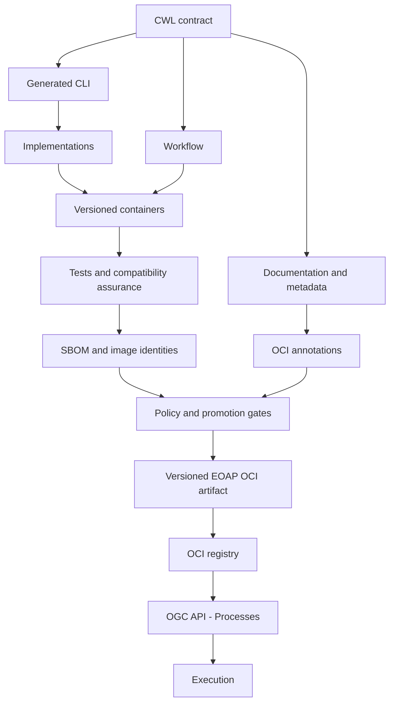

# Contract-first Water Bodies

Design the application contract, derive interfaces, implement the real raster algorithm, compose the workflow, then package and deploy a tested release.

Start with the [learning path](learning-path.md) and [prerequisites](prerequisites.md).

The CWL contract is the authoritative description of the EO application. Implementations, interfaces, workflow composition, documentation, metadata, supply-chain evidence, packaging and deployment artifacts are derived from or traceable back to it.

A machine-readable EO application contract provides inputs and evidence for software supply-chain assurance. Security depends on inventory, scanning, policy, identity, signing and promotion working together.

