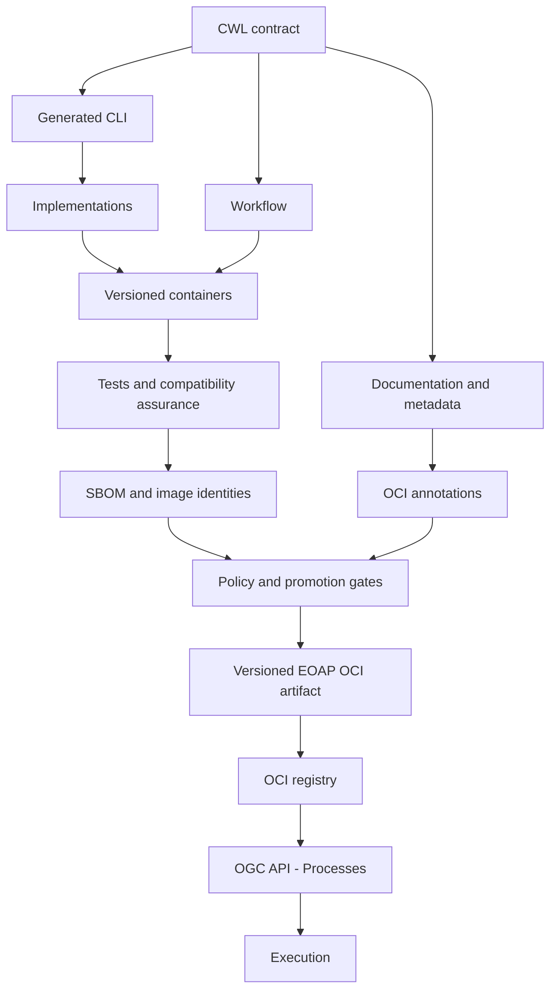

# Contract-first Water Bodies

**Contract first** means defining how an application is used before implementing it: which inputs it accepts, which outputs it produces, and how it is invoked. This contract becomes the shared reference for implementation, testing and documentation. For Water Bodies, it describes how to supply satellite data and processing parameters and what results to expect.

**CWL (Common Workflow Language)** is an open standard for describing command-line tools and connecting them into workflows. Its machine-readable documents describe inputs, outputs, command-line arguments and execution requirements, such as container images. A CWL runner uses these descriptions to execute tools and pass results between workflow steps. In this course, CWL expresses the application contract; Python implements the raster-processing algorithms.

Design the application contract, derive interfaces, implement the real raster algorithm, compose the workflow, then package and deploy a tested release.

Start with the [learning path](learning-path.md) and [prerequisites](prerequisites.md).

The CWL contract is the authoritative description of the EO application. Implementations, interfaces, workflow composition, documentation, metadata, supply-chain evidence, packaging and deployment artifacts are derived from or traceable back to it.

A machine-readable EO application contract provides inputs and evidence for software supply-chain assurance. Security depends on inventory, scanning, policy, identity, signing and promotion working together.

One CWL contract connects every block below. Interfaces, documentation and metadata are generated from it; implementations, release artifacts and execution evidence are built and checked against it.

| Block | Purpose and connection to the single contract |
| --- | --- |
| **CWL contract** | Defines the tools, inputs, outputs, workflow connections and software metadata that all subsequent artifacts refer to. |
| **Generated CLI** | Derives command-line interfaces from the CWL tool definitions with cwl2click, keeping commands and options aligned with the declared inputs. |
| **Workflow** | Composes the tools and connects their inputs and outputs within the same CWL document, making the processing sequence executable. |
| **Documentation and metadata** | Generates readable documentation, workflow diagrams and CodeMeta from the contract, reusing its process descriptions and software metadata. |
| **Implementations** | Supplies the Python raster-processing algorithms behind the generated interfaces, fulfilling the inputs and outputs promised by the contract. |
| **Versioned containers** | Packages those implementations and their dependencies into versioned execution environments referenced by the CWL tools. |
| **Tests and compatibility assurance** | Checks that interfaces, scientific results and workflow execution satisfy the contract, and compares contract versions to support compatibility review. |
| **SBOM and image identities** | Follows the contract's container references to inventory software, record resolved image identities and report coverage gaps using cwl2sbom and Trivy. |
| **OCI annotations** | Derives package annotations from the contract's software and process metadata with cwl2oci, carrying that description into OCI packaging. |
| **Policy and promotion gates** | Evaluates the release's inventory, scan results, integrity and compatibility evidence before promotion; policy criteria are defined by the project. |
| **Versioned EOAP OCI artifact** | Packages the CWL application for release, with annotations and associated evidence that connect it to the tested implementations and container identities. |
| **OCI registry** | Stores the versioned application artifact and associated evidence so the selected release can be retrieved for deployment. |
| **OGC API - Processes** | Exposes the deployed application through a processing service; cwl2ogc derives its input/output description from the same contract. |
| **Execution** | Runs the deployed workflow with supplied inputs and produces the declared outputs, completing the path from contract to processing results. |
