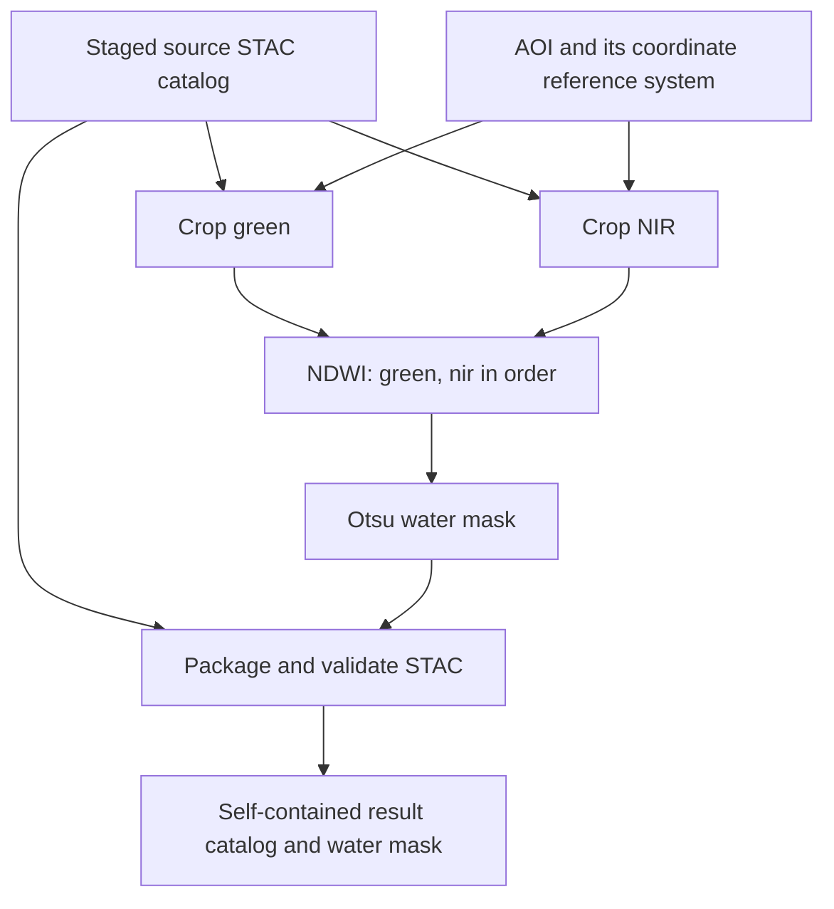

# Understand Water Bodies

Water Bodies turns satellite imagery into a water/non-water mask and packages the result with metadata. Before designing its contract, we need to understand the scientific inputs, the processing sequence and the meaning of the output.

The upstream [Water bodies detection lesson](https://eoap.github.io/mastering-app-package/app/water-bodies-detection/) introduces this application using Copernicus Sentinel-2 and Landsat-9 imagery. It describes two access patterns: processing Sentinel-2 STAC Item references and processing Landsat-9 data staged as a local STAC catalog. Both use green and near-infrared bands, NDWI and Otsu thresholding, followed by STAC packaging.

## From spectral bands to NDWI

Water tends to reflect more green than near-infrared (NIR) radiation. The Normalized Difference Water Index (NDWI) compares these bands:

```text
NDWI = (green - nir) / (green + nir)
```

The upstream lesson gives values above 0.2 as typical of water, with lower values for vegetation and some built-up surfaces. These are illustrative ranges, not a fixed classification rule for this course. [Source: Water bodies detection](https://eoap.github.io/mastering-app-package/app/water-bodies-detection/).

Our implementation requires exactly two rasters in **green, nir order**. Reversing them negates NDWI and changes the classification. Their dimensions, spatial transform and coordinate reference system must match so that each calculation compares the same ground location. A zero denominator can produce a nonfinite value, which the classification step handles explicitly.

## From NDWI to a water mask

Otsu selects a threshold from the pixel distribution by minimizing variation within two classes, equivalently maximizing their separation. This makes the threshold depend on the scene rather than a prescribed NDWI cutoff. [Source: Water bodies detection](https://eoap.github.io/mastering-app-package/app/water-bodies-detection/).

In this repository, Otsu uses only finite NDWI values. The output is a binary raster:

- **1 — water:** a finite NDWI value strictly greater than the computed threshold.
- **0 — non-water:** a value at or below the threshold, or a nonfinite value.

A raster with no finite values is rejected. The mask does not preserve a separate invalid-pixel class, so a zero can also represent an invalid NDWI calculation. Clouds, shadows, mixed pixels and atmospheric corrections affect real results; this scene-dependent classifier is not a universal guarantee of hydrological accuracy.

## Follow the processing graph

This course uses a **staged, self-contained STAC directory** containing a catalog, a source Item and local band assets. STAC (SpatioTemporal Asset Catalog) associates the data files with spatial, temporal and descriptive metadata. Remote data retrieval and authentication belong to staging, before the scientific workflow begins.

The canonical CWL defines four tool types. The crop step runs once per band, giving five tool executions for the default `green, nir` pair:



| Step | What it does | Output |
| --- | --- | --- |
| **Crop** | Selects a band by its EO common name and crops it to the area of interest (AOI). Both bands use the same AOI, transformed into the raster's coordinate system, and retain their source grids. | `crop_green.tif` and `crop_nir.tif` |
| **Normalized difference** | Checks that the cropped grids match, then calculates NDWI with the ordered band pair. | `norm_diff.tif` |
| **Otsu classification** | Computes the threshold from finite NDWI pixels and applies the strict greater-than rule. | `otsu.tif`, containing zeros and ones |
| **STAC packaging** | Uses PySTAC to describe the result and validate its metadata, retaining the source Item identity and time while describing the cropped product. | A `catalog` directory containing the result Item and mask asset |

Cropping to the same AOI does not itself align different source grids: the normalized-difference step rejects mismatches. The output raster files use Cloud Optimized GeoTIFF (COG), and the result Item carries projection and raster metadata. The final catalog makes the mask usable together with its location, acquisition time and asset reference.

## Predict a result before running it

The exercise uses a compact synthetic scene so the expected answer can be calculated directly:

| Image half | Green | NIR | NDWI | Expected class |
| --- | --- | --- | --- | --- |
| Left | 100 | 300 | -0.5 | Non-water |
| Right | 300 | 100 | +0.5 | Water |

Cropping the 8×8 fixture to `1,1,7,7` produces a 6×6 image, with three columns from each population. The expected mask therefore contains **18 water pixels**. This verifies the processing chain on controlled inputs; it does not measure accuracy on real satellite scenes.

## Connect the science to the contract

The single contract in `reference/waterbodies.cwl` captures these decisions before implementation:

- **Inputs:** a staged STAC `Directory`, an AOI, its coordinate reference system (default `EPSG:4326`) and an ordered band list (default `green, nir`).
- **Composition:** scatter the crop over the bands, pass the ordered rasters to normalized difference, classify the NDWI raster and package the mask with source metadata.
- **Output:** a self-contained STAC catalog `Directory`.

From these definitions, we derive command-line interfaces, workflow documentation, diagrams and metadata. The scientific implementations and their tests establish that those interfaces deliver the promised behavior. Band ordering, grid compatibility and classification semantics are therefore part of understanding the application, not merely packaging details.

## Contract questions

**What are we designing?** A workflow that turns staged green and NIR data into a water mask with validated STAC metadata.

**Why does it belong in the contract?** Clients and runners need agreed inputs, band ordering, processing connections and output expectations before choosing an implementation.

**What can be derived?** The CLI, workflow diagrams, documentation and metadata projections all follow from the same canonical CWL definitions.

**How do we verify it?** Complete [the exercise](exercise.md) to check the NDWI values, the 18 water pixels and the packaged result, then compare [the solution](solution.md). The processing tests also cover mismatched grids, invalid AOIs and nonfinite NDWI values.

[Module overview](README.md)
