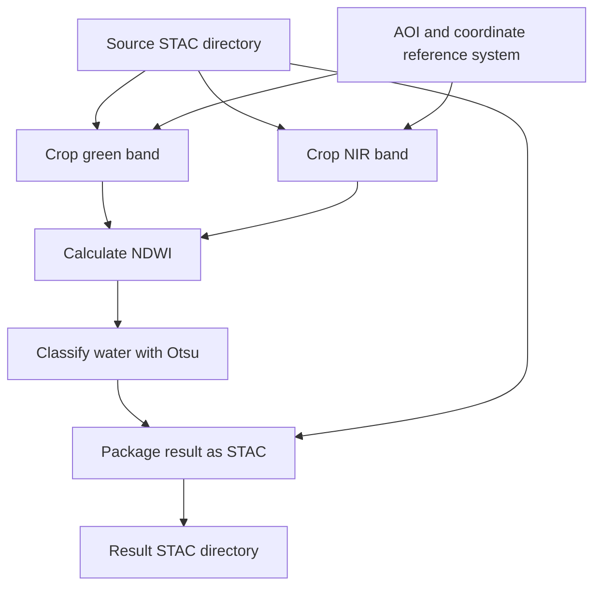

# Compose the workflow

So far, we have described individual tools: crop an image, calculate a water index, classify pixels and package the result. **Workflow composition** means connecting those tools so that the output of one becomes the input of the next. A user can then supply the initial data once and ask a CWL runner, such as `cwltool`, to carry out the complete process.

The workflow describes the connections and dependencies. Each tool still performs its own operation. For Water Bodies, the goal is to turn a staged satellite-data catalog and an area of interest into a catalog containing a water mask.

## Start with the inputs

The workflow in `reference/waterbodies.cwl` accepts four inputs:

| Input | Meaning |
| --- | --- |
| `item` | A `Directory` containing the source STAC catalog, its Item metadata and local raster assets. STAC associates data files with information such as their location and acquisition time. |
| `aoi` | The area of interest: the part of the image to process, expressed as a bounding box or polygon. |
| `epsg` | The coordinate reference system used to interpret the AOI coordinates. Its default is `EPSG:4326`, using longitude and latitude. |
| `bands` | The band names to extract, defaulting to `[green, nir]`. NIR means near-infrared; this order matters for the water-index calculation. |

`Directory`, `File` and `string` are CWL input and output types. Square brackets mean a list: `string[]` is a list of strings, and `File[]` is a list of files. Declaring types helps the runner check whether connected inputs and outputs are compatible.

## Follow the data through the steps



1. **Crop the two bands.** Run the crop tool once for green and once for NIR, using the same source directory, AOI and coordinate reference system. The results are two smaller raster files covering the area to process.
2. **Calculate NDWI.** Give the normalized-difference tool those files in green, NIR order. It checks that their grids match and calculates `(green - nir) / (green + nir)`, producing one water-index raster.
3. **Classify water.** Give the NDWI raster to the Otsu tool. It computes a threshold from finite pixel values and produces a binary mask: 1 for values strictly above the threshold, 0 otherwise.
4. **Package the result.** Give the STAC tool both the water mask and the original source directory. It needs the source metadata as well as the new raster to produce a validated, self-contained result catalog.

The arrows represent data dependencies. Normalized difference needs both cropped files; Otsu needs the NDWI file; packaging needs the mask and source metadata. The crop executions are independent and may run concurrently if the runner supports and enables that. Their completion order does not determine the order of files passed to normalized difference.

## Read a CWL step

The file's `$graph` holds several named definitions together: the `waterbodies` workflow and the four tool definitions. A reference such as `#crop` means “use the definition named crop in this same document.” These are the same tool contracts used to generate the CLI.

For example, this is the normalized-difference step from the workflow:

```yaml
norm-diff:
  run: '#norm-diff'
  in: {rasters: crop/cropped}
  out: [ndwi]
```

- **`norm-diff`** names this step within the workflow.
- **`run`** selects the tool definition to execute.
- **`in`** connects each tool input to its source. Here, the input named `rasters` receives the output named `cropped` from the step named `crop`.
- **`out`** identifies the tool outputs that this step makes available to the rest of the workflow. Here, `ndwi` can be referenced by a later step as `norm-diff/ndwi`.

The names on either side of a connection serve different roles. In `rasters: crop/cropped`, `rasters` is the receiving input, while `crop/cropped` identifies where its value comes from. The runner passes the produced files between steps; attendees do not need to copy intermediate files manually.

## Understand scatter: one crop call per band

The crop tool accepts one band name at a time. The workflow accepts a list of band names. **Scatter** tells the runner to repeat a step for each list element:

```yaml
crop:
  run: '#crop'
  in: {item: item, aoi: aoi, epsg: epsg, band: bands}
  scatter: band
  scatterMethod: dotproduct
  out: [cropped]
```

Here, `band: bands` connects the workflow's list to the crop step's `band` input. `scatter: band` asks the runner to distribute that list across separate executions. With the default inputs, it calls crop once with `green` and once with `nir`. The other inputs are shared by both calls.

The workflow declares `ScatterFeatureRequirement` to tell the runner it must support this feature. The selected `dotproduct` method pairs elements at the same position when several inputs are scattered together; here there is only one scattered input, so it simply visits each band.

Each crop execution produces one `File`. Scatter collects them into a `File[]` in the input-list order: green first, NIR second. That list becomes the normalized-difference input. Although `bands` is declared as a list, this scientific chain requires exactly that two-band ordering; adding arbitrary bands does not make it a general multi-band calculation.

There are therefore **four workflow steps but five tool executions** for the default inputs: two crops, one normalized difference, one classification and one packaging operation. The repetition is described in CWL, so the crop implementation remains responsible for processing a single band.

## Expose the final result

Intermediate files connect the steps, but the workflow needs to declare what it returns to its caller:

```yaml
outputs:
  stac-catalog:
    type: Directory
    outputSource: stac/stac-catalog
```

The outer `stac-catalog` is the public output name. `outputSource` connects it to the output named `stac-catalog` from the step named `stac`. The caller receives that result directory, containing the catalog, Item metadata and mask asset.

This completes the single-contract approach: CWL describes each tool's interface and how those interfaces connect. The generated CLI implements the command-line declarations, while the runner uses the workflow connections to coordinate their execution.

## Contract questions

**What are we designing?** A complete processing sequence assembled from four reusable tool contracts, including two executions of crop.

**Why does it belong in the contract?** The runner needs explicit inputs, outputs and dependencies to know what to execute and how to pass results between tools.

**What can be derived?** An executable workflow and a diagram of its connections, using the same tool definitions that generate the CLI and documentation.

**How do we verify it?** Follow [the exercise](exercise.md) to run the workflow and inspect both crop calls and the final directory. The runner test uses the installed CLI without containers and checks the resulting STAC metadata, 6×6 mask and 18 water pixels. Container execution is a separate check.

[Module overview](README.md)
