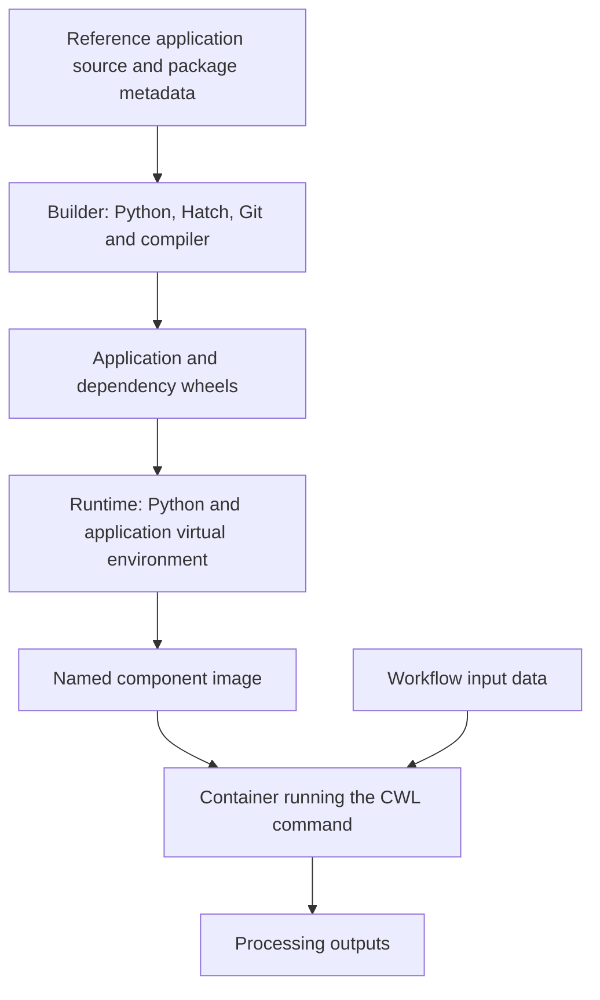

# Containerize

A working Python application depends on more than its source code. It also needs a Python interpreter, Python packages and operating-system libraries. If those differ between a developer's machine and a workflow server, the same command may behave differently or fail to start.

**Containerization** packages the application with its execution environment. In this module, we build environments for the four Water Bodies tools and connect them to the image references already declared in CWL.

## Image, container and registry

These terms describe different things:

| Term | Meaning in this course |
| --- | --- |
| **Dockerfile** | A build recipe listing the base environment, files to copy, software to install and default command. |
| **Image** | The packaged result of that recipe: application files, dependencies and configuration. It can be reused for many executions. |
| **Container** | A running instance of an image, started with a particular command and access to input and output locations. |
| **Registry** | A service that stores images for distribution. Here, `ghcr.io` is GitHub Container Registry. Building an image locally does not publish it there. |

The image contains the processing software. The workflow's satellite inputs and generated results are supplied separately at execution time. Containers share the host's kernel, so a suitable container engine and compatible platform are still needed; an image is not a complete virtual machine.

## Package the four tools

Each tool has a Dockerfile under `reference/containers/`:

| Component | Command the CWL tool runs | Image tag for this release |
| --- | --- | --- |
| Crop | `waterbodies crop` | `ghcr.io/eoap/waterbodies-crop:1.0.0` |
| Normalized difference | `waterbodies norm-diff` | `ghcr.io/eoap/waterbodies-norm-diff:1.0.0` |
| Otsu classification | `waterbodies otsu` | `ghcr.io/eoap/waterbodies-otsu:1.0.0` |
| STAC packaging | `waterbodies stac` | `ghcr.io/eoap/waterbodies-stac:1.0.0` |

For this release, all four images install the same application package from `reference/`. They have separate component names, but each contains the shared `waterbodies` CLI and implementations. The CWL command selects which operation to execute. Separately named images allow the components' packaging to evolve later without duplicating the scientific source now.

## Understand the two-stage build

The Dockerfiles follow the company's Rocky Linux 10.2 minimal pattern. A **multi-stage build** uses one environment to prepare the software and a second environment to run it. Only selected artifacts are copied between them.



### Build installable packages

The **builder stage** installs the tools needed to prepare Python packages, including Hatch, Git and a compiler. Hatch creates a **wheel**, an installable Python package archive, from the reference application. The builder then collects wheels for its dependencies into `/wheels`.

This stage may download software and dependencies. Its job is to prepare everything needed for the later application installation; it is not the environment used to execute the workflow.

### Prepare the execution environment

The **runtime stage** starts from a fresh base image and installs Python. It creates a user named `neo` with user and group IDs of 2000, then switches to that user. The application therefore runs without the default root user's privileges.

It also creates a **virtual environment** at `/app/venv`: a dedicated Python installation area for the application's packages. Adding its executable directory to `PATH` makes commands such as `python` and `waterbodies` use that environment.

The prepared wheels are copied into the runtime and installed with `--no-index --no-deps`. This application-installation step uses only the supplied wheels: it neither queries a package index nor resolves additional dependencies. The overall Docker build still uses the network earlier, including when preparing the runtime's system packages.

### Check and clean the image

Before finishing, the recipe runs:

- `python -m pip check` to check installed Python dependency compatibility.
- `waterbodies --help` to check that the application's command-line entry point starts.

It then removes `pip` from the application virtual environment and deletes the copied wheel archives. The compiler, Git and Hatch stay in the builder stage. This keeps build tooling out of the final application environment, but it does not replace vulnerability scanning or scientific tests. A successful help command confirms startup, not correct raster processing.

## Connect the image to the CWL contract

The crop tool contains these declarations:

```yaml
baseCommand: [waterbodies, crop]
hints:
  DockerRequirement:
    dockerPull: ghcr.io/eoap/waterbodies-crop:1.0.0
```

`baseCommand` defines the executable and subcommand. Input bindings add arguments such as `--input-item` and `--aoi`. `dockerPull` identifies the image to use when the runner executes with containers enabled.

These declarations are under `hints` in this repository. Our container execution uses those hints, while the explicit `--no-container` mode runs the installed Python application on the host. A successful host run therefore does not verify the image.

The Dockerfiles end with `CMD ["waterbodies", "--help"]`. `CMD` supplies a default when no command is given, so starting an image directly displays help. The runner supplies the actual tool command instead. The recipes do not define an `ENTRYPOINT`, which could otherwise prepend an executable to the command supplied by CWL.

## Distinguish release names from exact image identities

Consider the crop image reference:

```text
ghcr.io/eoap/waterbodies-crop:1.0.0
```

The registry is `ghcr.io`, the image repository is `eoap/waterbodies-crop`, and the **tag** is `1.0.0`. This tag uses semantic versioning, or SemVer: a human-readable `major.minor.patch` release name. Using explicit versions makes release intent clearer than using `latest`.

A tag can still be moved to different image content if the registry permits it. A **digest** identifies content by its cryptographic hash. A reference ending in `@sha256:` followed by the full digest selects that content rather than whichever image a tag currently names.

The release workflow builds and publishes versioned images, then invokes the Transpiler-Mate `cwl2sbom` plugin with Trivy for the `linux/amd64` platform. It records image identities and software inventories. After the evidence and policy checks, release preparation writes the reported repository digests into the release CWL. The application contract can then refer to the inspected execution environments precisely.

A digest provides identity, not proof of safety or scientific correctness. Also, rebuilding the same Dockerfile can pick up changed dependencies: obtaining an existing image by digest and rebuilding it from source are different operations. The `VERSION` build argument sets image metadata; it does not itself change the Python package's version. Release preparation must keep those versions coherent.

## Build and verify locally

From the repository root, with Docker available, build the four images:

```console
task containers:build VERSION=1.0.0
```

This assigns the release tags locally. Inspect one tool's interface inside its image:

```console
docker run --rm ghcr.io/eoap/waterbodies-crop:1.0.0 waterbodies crop --help
```

`--rm` removes this temporary container after it exits; the image remains available. Then run the complete scientific workflow using the images:

```console
task workflow:run-container
```

That task writes results under `build/container-result`. The container workflow checks that the packaged commands can work together with the supplied inputs. Compare this with `task workflow:run`, which explicitly uses `--no-container` and writes under `build/result`.

Follow [the exercise](exercise.md) to inspect the image identities and supply-chain evidence as well. Help, workflow execution and evidence checks answer different questions; no one check substitutes for all the others.

## Contract questions

**What are we designing?** Packaged execution environments for the four scientific tools, each referenced by the workflow contract.

**Why does it belong in the contract?** The runner needs both the command interface and the intended environment to execute the application consistently.

**What can be derived?** The CWL image references identify the processing dependencies to inventory and inspect. The Dockerfiles build their environments, and release preparation connects inspected digests back to the release contract.

**How do we verify it?** Build the images, inspect their CLI help, execute the container workflow and check the release's image identities and evidence. Confirm that the resulting scientific outputs still satisfy the contract.

[Module overview](README.md)
