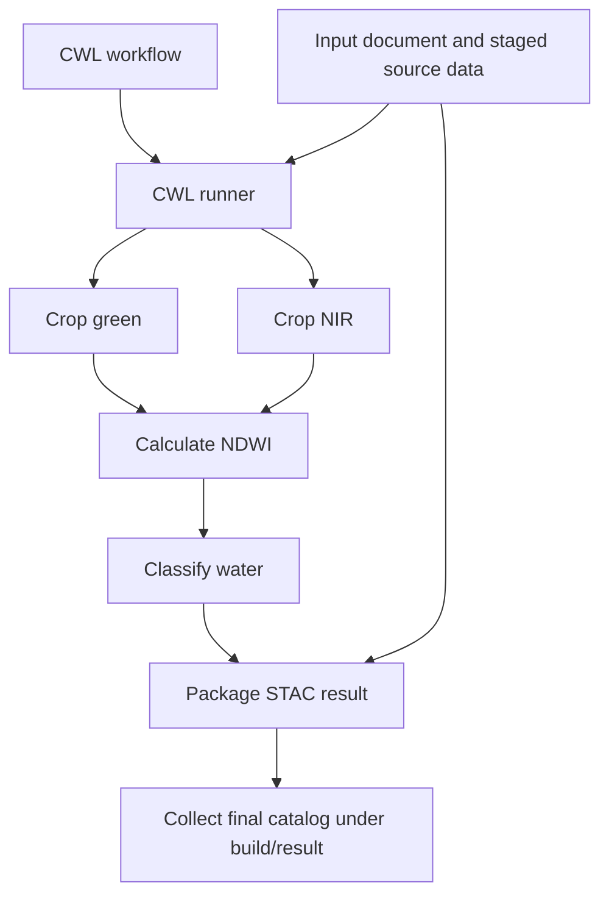

# Run the application

Running the application brings together three things: the **CWL contract**, the **input values for this run**, and an **execution environment** containing the tools. A CWL runner reads the contract, starts the required commands and passes their outputs to the next steps.

In this lesson, we use a small, predictable dataset to follow that process from start to finish. The aim is to verify that the tools work together and produce the results promised by the contract.

## Understand the practice dataset

A **fixture** is a prepared dataset used for repeatable tests. Our fixture is synthetic: its pixel values were chosen deliberately rather than measured by a satellite. It is still georeferenced, meaning its pixels have a defined position and coordinate reference system.

The fixture contains two 8×8 rasters, one green band and one near-infrared (NIR) band. Their values are stored as unsigned 16-bit integers. A STAC catalog and source Item describe the files, their location and acquisition time.

| Image half | Green value | NIR value | Expected NDWI |
| --- | --- | --- | --- |
| Left | 100 | 300 | `(100 - 300) / (100 + 300) = -0.5` |
| Right | 300 | 100 | `(300 - 100) / (300 + 100) = +0.5` |

This deliberately simple scene lets us calculate the expected answer before running any code. Cropping to the bounding box `1,1,7,7` leaves a 6×6 raster: three columns from each half. Otsu classification should identify the 18 pixels on the right as water.

The compact fixture keeps automated checks fast and avoids downloading a remote scene. It exercises real raster files and metadata, but it does not reproduce all the complexity of satellite observations.

## Prepare the environment and inputs

Run the following commands from the repository root after installing the tools listed in [Prerequisites](../../prerequisites.md):

```console
task setup
task fixtures:generate
```

`task setup` installs the application and development tooling using the recorded dependency versions. Initial installation requires network access. `task fixtures:generate` creates or refreshes the local source catalog and rasters under `data/fixtures/source`.

The workflow's **input document**, `reference/inputs.yaml`, supplies values for one execution:

```yaml
item:
  class: Directory
  path: ../data/fixtures/source
aoi: "1,1,7,7"
epsg: EPSG:4326
bands: [green, nir]
```

The contract defines the accepted inputs; this document chooses their values:

- **`item`** identifies the staged source directory. `class: Directory` tells CWL that the value represents a directory, not an ordinary string. The relative path is resolved from the input document's location, so it points from `reference/` to `data/fixtures/source`.
- **`aoi`** specifies the area of interest as minimum longitude, minimum latitude, maximum longitude and maximum latitude for this coordinate system.
- **`epsg`** identifies that coordinate system. `EPSG:4326` means longitude and latitude coordinates.
- **`bands`** selects green and NIR in the order required by the normalized-difference calculation.

A new dataset normally needs a new input document, not a second copy of the workflow. Its staged catalog and assets must still satisfy the application's input expectations.

## Start a complete local run

For an initial run using the installed Python application, execute:

```console
task workflow:run
```

The task expands to:

```console
uv run cwltool --no-container --outdir build/result 'reference/waterbodies.cwl#waterbodies' reference/inputs.yaml
```

Read the command from left to right:

| Part | Purpose |
| --- | --- |
| `uv run` | Runs the command in the project's Python environment. |
| `cwltool` | Starts the CWL runner that coordinates the workflow. |
| `--no-container` | Uses the installed application on the host instead of Docker images. |
| `--outdir build/result` | Chooses where the runner collects the final workflow outputs. |
| `reference/waterbodies.cwl#waterbodies` | Selects the definition named `waterbodies` inside the CWL document. |
| `reference/inputs.yaml` | Supplies the input values for this execution. |

The generated `waterbodies` CLI performs each tool operation. `cwltool` coordinates those operations according to the workflow connections. A successful local run checks the installed application; it does not establish that the container images work.

## Follow what the runner does



The runner makes input files and directories available to each job, starts the commands and connects their declared outputs. Watch its progress messages for two crop executions, followed by normalized difference, Otsu classification and STAC packaging. The crop jobs may complete in either order; their collected outputs retain the green, NIR ordering specified by the input list.

Jobs use separate working locations. Intermediate files such as cropped bands and NDWI support later steps, while the workflow declares the final STAC directory as its public result. Do not expect every intermediate raster to appear in `build/result`.

When running individual CLI commands manually, use a separate scratch directory because they write output files into their working directory. The workflow runner handles that job separation for the complete application.

## Inspect the result, not just the exit status

A command that exits successfully has completed without reporting an error. We still need to inspect what it produced. For this fixture, the collected output includes:

```text
build/result/catalog/
├── catalog.json
└── synthetic/
    ├── synthetic.json
    └── otsu.tif
```

`catalog.json` links to the result Item. The Item describes the product and links to its `otsu.tif` asset, the binary water mask. The Item keeps the source identity and acquisition time, while its footprint and raster metadata describe the cropped result.

From the repository root, inspect and validate that output through the application's PySTAC-based reader:

```python
from pathlib import Path

import numpy as np
import rasterio
from waterbodies.common import read_item
from waterbodies.validation import validate_item

item = read_item(Path("build/result/catalog"))
validate_item(item)
mask_path = item.assets["data"].get_absolute_href()
assert mask_path is not None
with rasterio.open(mask_path) as raster:
    mask = raster.read(1)
    print("Raster shape:", raster.shape)
    print("Water pixels:", np.count_nonzero(mask))
print("Item:", item.id)
print("Footprint:", item.bbox)
```

Run the snippet with the project interpreter, for example in a `uv run python` session. Expect a shape of `(6, 6)`, **18 water pixels**, Item ID `synthetic` and bounding box `[1, 1, 7, 7]`.

The catalog is self-contained: its mask is included and its local references are relative. Copy the entire `catalog` directory to another location, then read it from that new path and resolve its asset again. Moving only the Item JSON without its related files would not test portability of the complete product.

## Check the packaged execution too

After building the images as described in [Containerize](../08-containerize/lesson.md), run:

```console
task workflow:run-container
```

This task enables container execution and writes outputs under `build/container-result`. The contract and input values remain the same; the tools now run inside the declared images. Inspect the resulting catalog and mask using the same expectations as the host run.

## Use automated checks to investigate problems

`task workflow:test` runs the end-to-end test with the installed application and checks the final catalog, metadata validation, raster dimensions and water-pixel count. `task reference:test` runs the broader contract, quality, test and supply-chain checks used by the exercise.

The processing tests examine additional details, including Cloud Optimized GeoTIFF layout, NDWI values, binary classes, source time, cropped footprint, extension metadata and portable source assets. These checks help distinguish interface and packaging problems from scientific calculation problems.

If execution fails, first identify the failing step in the runner messages. Check its inputs and command: an unreadable directory, a missing band or mismatched raster grids point to different causes. Use a fresh output location when diagnosing a run so earlier results are not mistaken for new ones.

Passing these checks demonstrates the expected behavior on controlled data. Accuracy on real scenes, including clouds, shadows and mixed pixels, requires separate scientific validation.

## Contract questions

**What are we designing?** A repeatable execution that starts from declared inputs and produces a verifiable scientific result.

**Why does it belong in the contract?** The runner needs the input types, tool connections and output declarations to stage data, coordinate execution and collect the result.

**What can be derived?** The execution commands and data connections follow from the same CWL used for the CLI and documentation; the input document supplies values for each run.

**How do we verify it?** Complete [the exercise](exercise.md), inspect the mask and STAC metadata, test catalog portability and compare host and container results. Use the automated tests to check the expected 6×6 grid and 18 water pixels.

[Module overview](README.md)
