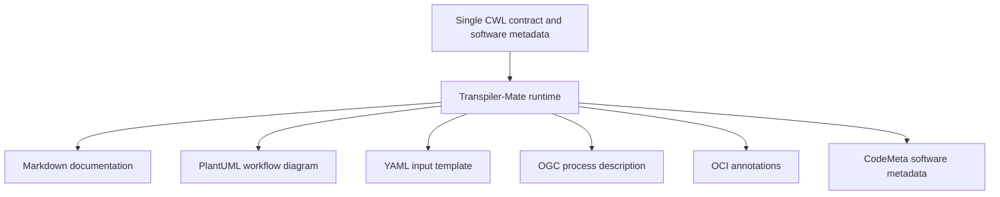

# Derive artifacts

An **artifact** is a file produced by a tool for someone or something else to use. In the previous lesson, execution produced a scientific result: a water mask and its STAC catalog. Here, we generate files that **describe the application**: documentation, diagrams, input templates and metadata for services and packages.

These descriptions start from the same CWL contract. We do not need to run the raster-processing workflow to generate them. Instead, Transpiler-Mate reads its tool definitions, connections and software metadata and presents that information in several useful forms.

## One contract, several audiences

Different readers need different views of Water Bodies. An attendee wants to understand the processing steps. A workflow user needs an input file. A service client needs input and output descriptions. A registry or research catalog needs software identity and metadata.

Maintaining each description independently would repeat information such as the application name, version and inputs. **Derivation keeps those descriptions connected to one source of truth.** When the contract changes, regenerate the affected artifacts and review them together.



The contract supplies shared information; each plugin decides how to represent it in its output format. Some generation options also provide additional context, such as the source-code repository URL.

## Select the workflow and its plugins

`transpiler-mate` is the common command-line entry point. Plugins installed alongside its runtime become subcommands, such as `transpiler-mate cwl2inputs`. Each plugin produces a particular kind of output.

The source argument used here is:

```text
reference/waterbodies.cwl#waterbodies
```

The file contains a workflow and four tool definitions in one `$graph`. The fragment `#waterbodies` selects the workflow named `waterbodies`, so the plugins describe that application rather than an individual processing tool.

For example, this command generates a starter input document:

```console
uv run transpiler-mate cwl2inputs --output build/inputs.yaml 'reference/waterbodies.cwl#waterbodies'
```

The repository's `scripts/derive.sh` records the generation commands for all six artifact types. After completing the repository setup, run them together from the repository root:

```console
task artifacts:derive
```

The task writes to `reference/expected`, refreshing the tracked examples there. Those examples are actual plugin outputs, not manually written substitutes. To experiment without replacing them, choose another output directory:

```console
uv run bash scripts/derive.sh reference/waterbodies.cwl build/artifacts
```

The locations below are relative to whichever output directory you choose.

## Understand the generated files

| Plugin | Output location | Who uses it and why |
| --- | --- | --- |
| **cwl2markdown** | `docs/waterbodies.md.jinja` | Readers use the rendered Markdown to understand the application and its interface. See the filename note below. |
| **cwl2puml** | `diagrams/waterbodies/component.puml` | Readers use a workflow diagram to inspect the processing structure. This file contains PlantUML diagram source. |
| **cwl2inputs** | `inputs.yaml` | Workflow users fill in a starter input document before execution. |
| **cwl2ogc** | `ogc/processes.json` | Service developers inspect the application's OGC API – Processes description, including its inputs and outputs. |
| **cwl2oci** | `oci/annotations.json` | Packaging tools use descriptive annotations when publishing the CWL application as an OCI artifact. |
| **cwl2codemeta** | `publication/codemeta.json` | Software catalogs and research tooling use structured metadata describing the application and its source repository. |

### Documentation and diagrams

Markdown is a readable text format that can be rendered as a documentation page. The generated document gives readers a view of the contract; explanations of scientific reasoning and exercises remain authored course material.

PlantUML describes diagrams as text. Our script requests a component diagram and disables image conversion with `--no-convert-image`. You therefore receive a `.puml` source file, not a PNG or SVG image. Rendering that source is a separate step.

Inspect the diagram alongside the workflow: identify crop, normalized difference, Otsu and STAC packaging. Use it to discuss their connections while keeping the CWL authoritative for execution behavior.

### A template for execution inputs

The generated YAML includes defaults from the contract, such as `[green, nir]` and `EPSG:4326`. It also contains placeholders where the caller must supply a value:

```yaml
aoi: a_string
item:
  class: Directory
  path: a/directory/path
```

These placeholders describe the shape of the expected input; they are not usable scene data. Copy the template to a run-specific input file, replace the AOI and directory path, and check the band ordering. Relative paths must make sense from that input file's location.

Compare the template with `reference/inputs.yaml`, which provides the concrete values for our synthetic example. Generate the interface shape once, then choose input values for each execution.

### An OGC process description

OGC API – Processes provides an interface for describing and executing processing services. The generated JSON describes Water Bodies to a service-facing consumer: its identifier, version, inputs and outputs, together with metadata and schemas describing accepted values.

For example, inspect the entries for `aoi`, `bands` and the final `stac-catalog` output and trace them back to CWL. Review the plugin's representation of file and directory inputs carefully: a description alone does not establish how a particular server receives or stages data.

Generating this file does not deploy a server or execute a job. Service deployment and the transfer of inputs remain separate integration steps.

### OCI annotations for packaging

OCI means Open Container Initiative. Here, we use OCI packaging to distribute the CWL application artifact with descriptive metadata. Its annotations include the title, version, license and selected CWL entry point.

The generated JSON wraps these annotations in a top-level `$manifest` object. That wrapper is the structure used by ORAS with `--annotation-file` when applying annotations to an artifact manifest, the registry document describing the packaged artifact.

Inspect values such as `org.opencontainers.image.version` and `org.cwl.entrypoint` and compare them with the contract. The plugin produces metadata; it does not build a container image, upload an artifact or approve a release.

### CodeMeta for software discovery

CodeMeta provides structured software metadata using JSON-LD, a JSON format that gives fields shared, machine-readable meanings. Our generated document uses CodeMeta 3.0 and includes the application's name, author, license and version, along with repository information.

The software metadata comes from the CWL document, while the script also supplies `--code-repository`. This option matters: repository URLs are generation inputs too, so review them before publication rather than assuming every field came directly from CWL.

Inspect the generated `targetProduct` and `codeRepository` fields. This export prepares a software description; publishing a research record or obtaining an identifier is a later operation.

## Recognize the repository's Markdown compatibility handling

The cwl2markdown revision used by this repository has a template filename mismatch. The generation script calls a small compatibility adapter before invoking the original runtime and plugin. The adapter resolves the template filenames; the plugin still performs the rendering.

Its output is named `waterbodies.md.jinja`, but the file already contains rendered Markdown. You do not need to render it as a template again. This behavior belongs to the inspected dependency revision, not to a general plugin option or a requirement for all releases.

Use `task artifacts:derive` to reproduce the repository's supported generation path. If a future plugin release changes the output name or removes the need for the adapter, review that as a tooling update.

## Review meaning as well as successful generation

After generation, check that all six outputs exist and inspect what they say:

1. Confirm the selected process is Water Bodies and the version matches the contract.
2. Trace the input names, defaults and output descriptions back to CWL.
3. Identify values that need user input or additional configuration, such as template paths and repository URLs.
4. Check the format needed by the next consumer: PlantUML source for a renderer, input YAML for a runner, or annotations for ORAS.

Some plugins can emit timestamps or vary the ordering of metadata entries. A text difference therefore does not always mean the application's behavior changed. Inspect the changed values and relationships; record the source contract, plugin versions and generation options when reproducibility matters.

These six descriptions also do not constitute execution results or supply-chain evidence. Compatibility reports and software inventories require their own generation and inspection steps, covered in later modules. The shared contract connects those activities, but each artifact answers a different question.

## Contract questions

**What are we designing?** Several useful descriptions of one application, tailored to readers, workflow users, service developers and packaging tools.

**Why does it belong in the contract?** Keeping interfaces and software metadata in one authoritative source reduces disagreement between the generated descriptions.

**What can be derived?** Markdown, a PlantUML diagram, an input YAML template, an OGC process description, OCI annotations and CodeMeta metadata.

**How do we verify it?** Complete [the exercise](exercise.md), inspect the six generated outputs and trace their values to the contract or explicit generation options. Distinguish placeholders and descriptions from runnable inputs, deployed services and published artifacts.

[Module overview](README.md)
