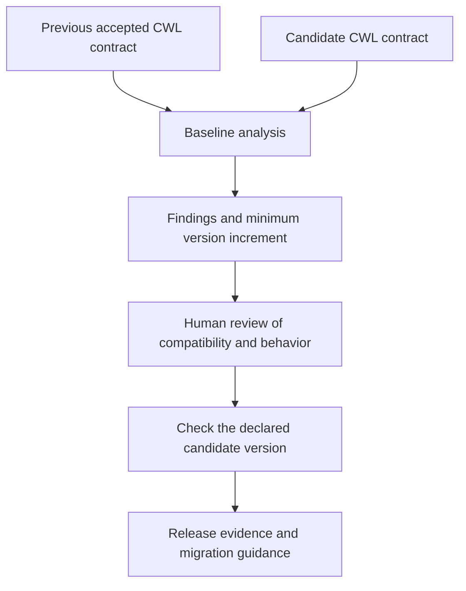

# Evolve and assure the contract

Once other people use an application, its interface becomes a promise. Their input files, scripts and workflows depend on its parameter names, accepted values, defaults and outputs. A change that looks small to the developer can break those existing uses.

This lesson introduces **baselining**: comparing a proposed release with an accepted earlier release to understand what changed and what that means for callers. We then use that analysis to choose a version number that communicates the compatibility impact.

## What is a baseline?

A **baseline** is the reference version against which we assess a candidate. Here, the baseline is the previous CWL application contract. The candidate is the CWL contract we want to release next.

The comparison asks: can someone who used the previous contract continue using the new one without changing their inputs or relying on different behavior? This is the central question of **backward compatibility**.

Baselining differs from testing one version in isolation. Tests can show that the candidate works with its current example inputs. A comparison can reveal that an older, previously valid input file would now fail. Both forms of evidence matter.



For a real release, choose the actual previous accepted release as the baseline. Comparing only with a convenient recent development commit could miss changes that users have never received.

## Give version numbers a consistent meaning

**Semantic Versioning**, usually shortened to **SemVer**, uses `MAJOR.MINOR.PATCH`. For a stable public interface starting at version 1.0.0, the increment communicates compatibility:

| Increment | Meaning | Example from `1.0.0` |
| --- | --- | --- |
| **Patch** | A backward-compatible bug fix. | `1.0.1` |
| **Minor** | New functionality that preserves backward compatibility. | `1.1.0` |
| **Major** | A change that breaks the public interface. | `2.0.0` |

A minor increase resets the patch number; a major increase resets both minor and patch. Published release contents should remain unchanged: distribute subsequent modifications under a new version. These rules come from the [Semantic Versioning specification](https://semver.org/).

In this course, the public interface includes the CWL inputs, outputs and their documented meaning. Consistent versioning lets workflow authors plan upgrades and recognize when migration is required. The size of a code diff is not the measure of compatibility: removing one default can affect every caller that relied on it.

Review the full change set before deciding. An optional feature might preserve existing uses, while a new required input does not. Scientific behavior also needs attention: keeping the same input names does not establish that a changed algorithm still fulfills the previous contract.

## Work through the example: remove the default CRS

The lesson provides two contracts under `modules/11-assure-the-contract/`:

| Contract | Declared version | Workflow `epsg` input |
| --- | --- | --- |
| `v1/waterbodies.cwl` | `1.0.0` | String with default `EPSG:4326`. |
| `v2/waterbodies.cwl` | `2.0.0` | String with no default. |

`epsg` identifies the coordinate reference system (CRS) used to interpret the area-of-interest coordinates. In v1, the definition is:

```yaml
epsg:
  type: string
  default: EPSG:4326
```

The default allows a caller to leave `epsg` out of the workflow input document. The runner then uses `EPSG:4326`. In v2, the definition becomes:

```yaml
epsg: string
```

The input still accepts a string, but it is now required explicitly. Consider a caller whose input file supplies `item`, `aoi` and `bands` but omits `epsg`: it works under v1 and fails input validation under v2. Callers that already supply `epsg` may continue working, but compatibility must account for the previously valid omission too.

That is why the example requires a **major increment from `1.0.0` to `2.0.0`**. A patch or minor label would understate the change. Migration guidance should tell affected users to add `epsg: EPSG:4326` if their AOI coordinates use that system, or supply the appropriate CRS for their coordinates.

The repository's regular `reference/inputs.yaml` already includes `epsg`. Running only that input file would not expose the lost ability to omit it. This illustrates the value of reviewing the contract itself.

## Run the analysis before enforcing a release decision

The **cwl-baseline-plugin** is a Transpiler-Mate plugin invoked as `transpiler-mate baseline`. It compares resolved process descriptions, including interfaces and declared environment or behavior information. It does not execute the raster algorithms to prove scientific equivalence.

From the repository root, generate an initial report:

```console
mkdir -p build
uv run transpiler-mate baseline \
  modules/11-assure-the-contract/v2/waterbodies.cwl \
  --previous modules/11-assure-the-contract/v1/waterbodies.cwl \
  --output build/baseline.json
```

The positional argument is the candidate. `--previous` chooses the baseline, and `--output` selects the JSON report location. Starting without `--check` lets you inspect findings before asking the command to enforce the release conditions.

The comparison covers the processes in the documents, so findings can refer to an individual tool as well as the top-level workflow. Normalization prepares the CWL for comparison; the analysis goes beyond comparing lines of YAML text.

## Read the findings

Each entry in `findings` explains a detected difference:

| Field | How to read it |
| --- | --- |
| `rule` | The kind of change detected, such as `input.omission_removed`. |
| `path` | The location in the compared process description, such as `/processes/waterbodies/inputs/epsg`. |
| `before` and `after` | The values seen in the baseline and candidate. |
| `before_present` and `after_present` | Whether the field existed, helping distinguish removal from an explicit null value. |
| `minimum_bump` | The increment established by this finding's automatic rule. |
| `review_required` | Whether the finding needs human compatibility assessment. |

For this example, focus on three kinds of findings:

1. **`input.omission_removed`** identifies that `epsg` can no longer be left out. It establishes an automatic minimum increment of `major`.
2. **`default.changed`** records the removed default and asks for behavioral review. The report's `after` value is null because the default is absent; `after_present: false` confirms the removal. It does not mean v2 accepts null as the CRS.
3. **`behavior.changed`** can appear for generated array-type names. The inspected tooling assigns internal identifiers beginning with `_:` to anonymous array schemas, and those identifiers can differ between loads even when the source array definition is unchanged.

For an array-name finding, compare the actual array definitions before deciding whether behavior changed. Review every finding; do not assume all behavioral differences are generated-name noise. Also, `minimum_bump: none` on an individual finding does not mean it is harmless when `review_required` is true—it means the automatic rule has not assigned an increment for that difference.

## Complete the review and check the version

Adding `--check` makes the command enforce its release checks. In this lesson, checking before resolving the review findings is expected to fail even though v2 already declares `2.0.0`. A sufficient version number does not itself complete the review.

After assessing the known changes, record the classification and check the candidate:

```console
uv run transpiler-mate baseline \
  modules/11-assure-the-contract/v2/waterbodies.cwl \
  --previous modules/11-assure-the-contract/v1/waterbodies.cwl \
  --output build/baseline-reviewed.json \
  --review-bump major \
  --check
```

`--review-bump major` states the reviewer's classification. It does not perform the review or rewrite the candidate version. The lesson's candidate already contains the required version change.

The recorded example in `reference/expected/baseline/report.json` shows how to read the resulting summary:

| Summary field | Recorded value | Meaning |
| --- | --- | --- |
| `previous_version` | `1.0.0` | Version of the baseline. |
| `current_version` | `2.0.0` | Version declared by the candidate. |
| `minimum_bump` | `major` | Required increment after analysis and review. |
| `minimum_version` | `2.0.0` | Minimum release version for this comparison. |
| `review_bump` | `major` | Explicit reviewer classification. |
| `review_required` | `false` | No outstanding review at the report-summary level. |
| `declared_version_sufficient` | `true` | The declared version meets the assessed minimum. |

Individual findings can retain `review_required: true` as a record of what needed assessment, while the summary records that a review classification was supplied. Read both levels together.

`task baseline:check` performs the reviewed check for this known teaching example and refreshes `reference/expected/baseline/report.json`. Its built-in major classification is specific to this lesson. The production release workflow requires an explicit review classification as an input rather than treating that teaching decision as approval for every release.

## Carry the decision into the release

Once compatibility has been assessed, keep the candidate CWL version, application package version and intended release metadata coherent. Regenerate the affected CLI and descriptive artifacts, run the relevant tests and explain required input changes to users.

A passing baseline check supports a release decision; it does not replace scientific validation, container verification or supply-chain checks. It also cannot detect an implementation change that is not represented in the compared contract. Preserve the report together with tests and review evidence so the version decision is understandable later.

## Contract questions

**What are we designing?** A reviewed change from an accepted public contract to a candidate release, with a version that reflects its compatibility impact.

**Why does it belong in the contract?** Callers depend on input defaults and other declared behavior; changes must be visible and assessed against their existing uses.

**What can be derived?** A comparison report identifying changes, automatic minimum increments, review findings and whether the candidate's version is sufficient.

**How do we verify it?** Complete [the exercise](exercise.md), explain why omitting `epsg` stops working, inspect all findings and apply the explicit major review before running the check. Use tests and migration guidance to support the decision.

[Module overview](README.md)
