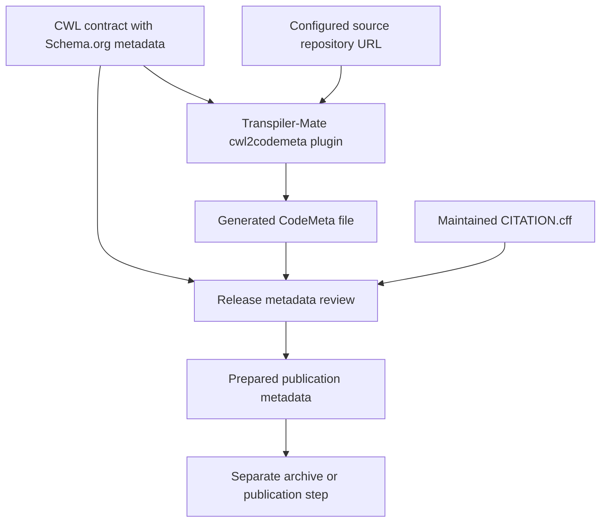

# Publish research software

A researcher who uses Water Bodies needs more than a command that runs. They need to know what the software does, who created it, which version was used, where it can be found and how to acknowledge it. **Software metadata** records those facts in a form that people and tools can read.

This lesson prepares that description for discovery and citation. The verified generation step produces a CodeMeta file from metadata embedded in CWL. Publishing a research record, uploading a release or obtaining a persistent identifier is a subsequent activity; generating a local file does not perform those actions.

## Start with Schema.org: a shared vocabulary

**Schema.org** defines shared names for describing things and their relationships. A vocabulary gives a field a meaning that different systems can recognize: `author` identifies who created something, while `softwareVersion` identifies its software version. Types such as `SoftwareApplication`, `Person` and `Organization` describe what kind of thing is being represented. See the [Schema.org software vocabulary](https://schema.org/SoftwareApplication).

In our CWL, the prefix `s:` refers to that vocabulary:

```yaml
$namespaces:
  s: https://schema.org/
s:name: Water Bodies
s:softwareVersion: "1.0.0"
s:license: https://spdx.org/licenses/Apache-2.0
```

This is an excerpt from `reference/waterbodies.cwl`. `$namespaces` declares a shorthand, so `s:softwareVersion` refers to `https://schema.org/softwareVersion`. The full document also describes the application, author, publisher and help location.

CWL supplies the executable contract—inputs, outputs, commands and workflow connections. The Schema.org fields supply descriptive metadata alongside it. This keeps the application's interface and identity together without making descriptive fields responsible for executing the workflow.

Schema.org is a metadata vocabulary; it should not be confused with JSON Schema, which is used to describe and validate the structure of JSON data.

## Connect Schema.org to CodeMeta

**CodeMeta** specializes in exchanging software metadata. It reuses Schema.org terms and adds software-specific terms, allowing repositories and research systems to share descriptions using a common vocabulary. Its mappings between metadata formats are called **crosswalks**: they identify which fields express corresponding concepts. See the [CodeMeta introduction](https://codemeta.github.io/) and [term definitions](https://codemeta.github.io/terms/).

CodeMeta uses **JSON-LD**, meaning JSON for Linked Data. In the generated file, `@context` identifies the vocabulary context used to interpret the fields, and `@type` identifies the kind of object described. These give names in the JSON shared meanings rather than leaving every consumer to guess their interpretation.

Our Transpiler-Mate **cwl2codemeta plugin** generates CodeMeta 3.0. Its recorded output has two connected objects:

- The outer object has `@type: SoftwareSourceCode` and records the source repository and development links.
- `targetProduct` has `@type: SoftwareApplication` and contains the application metadata derived from CWL.

This is the structure produced by this repository's plugin invocation, not a requirement that every CodeMeta document use the same nesting. The distinction helps a reader separate the source-code project from the application that code implements.

## Trace the actual field mapping

Open `reference/waterbodies.cwl` alongside `reference/expected/publication/codemeta.json`. The following paths show where the values appear in our generated output:

| Source | Generated CodeMeta field | Meaning |
| --- | --- | --- |
| `s:name` | `targetProduct.name` | Application name: Water Bodies. |
| `s:description` | `targetProduct.description` | What the application does. |
| `s:softwareVersion` | `targetProduct.softwareVersion` | The application release being described. |
| `s:license` | `targetProduct.license` | The declared license reference. |
| `s:author` | `targetProduct.author` | Author details, including names and affiliation. |
| `s:publisher` | `targetProduct.publisher` | The organization identified as publisher. |
| `s:softwareHelp` | `targetProduct.softwareHelp` | Where users can find help. |
| `s:dateCreated` | `targetProduct.dateCreated` | The creation date recorded in the contract. |
| `--code-repository` generation option | `codeRepository` | The source-code repository supplied to the plugin. |

The names often stay recognizable because CodeMeta shares Schema.org terms. The plugin also adds repository-related links to the outer record. Those depend on generation configuration, so review the command options as well as the CWL when checking an export.

A converter carries supplied information into another representation. It does not establish that an author list is complete, a repository URL is correct or a version has actually been released. Those remain release-review responsibilities.

## Understand the other publication formats

Several formats reuse concepts such as title, authors and version, but they serve different purposes:

| Format or vocabulary | Main question it helps answer | Relationship to this lesson |
| --- | --- | --- |
| **Schema.org** | What is this software, and who or what is associated with it? | Supplies the descriptive terms embedded in CWL. |
| **CodeMeta** | How can systems exchange a structured description of research software? | Generated and inspected in this repository. |
| **Citation File Format (CFF)** | How should someone cite the software? | Stored in the separately maintained `CITATION.cff`. |
| **DataCite metadata** | How is a research resource identified and described for citation and retrieval? | An additional publication metadata model, outside the verified generation path here. |
| **RO-Crate** | Which research files and resources belong together, and how are they related? | A packaging approach introduced for context; this course does not generate a crate. |

### CFF: instructions for citation

A `CITATION.cff` file gives human- and machine-readable citation information. A user can find the intended software title, authors and release details without constructing a citation from a repository name. See the [Citation File Format introduction](https://citation-file-format.github.io/).

Our file uses CFF's own field names: `title` corresponds to the software's citation title, `authors` records credited people, and `version` identifies the cited release. These overlap conceptually with CodeMeta's `name`, `author` and software version, but the files are not interchangeable copies.

In this repository, `CITATION.cff` is editorial metadata: maintainers update it during release preparation. `task artifacts:derive` does not regenerate it. Its citation title deliberately includes the learning-package context, while the CWL application name is simply Water Bodies. Consistency means describing the intended software and release accurately, not forcing every title string to be identical.

### DataCite: describing a citable resource

DataCite defines metadata properties for identifying resources and supporting citation and retrieval. Shared concepts such as creators, titles and versions can be mapped into that model, but a publication workflow must satisfy the destination's metadata requirements. See the [DataCite Metadata Schema](https://schema.datacite.org/).

Producing metadata does not itself register a DOI, a persistent identifier used to reference a resource. This repository's verified exercise performs neither a DataCite export nor DOI registration. Do not treat the presence of a CodeMeta file as evidence that either has happened.

### RO-Crate: describing a research package and its parts

An RO-Crate connects research resources with their metadata. It can describe files, software, people and their relationships, using Schema.org and JSON-LD. This makes its vocabulary related to the metadata discussed here, while its scope includes a package and its constituent resources. See [About RO-Crate](https://www.researchobject.org/ro-crate/about_ro_crate).

For Water Bodies, a future crate could describe the workflow alongside documentation or selected data. Describing a particular execution would additionally require evidence of that run and its inputs and outputs. A software description alone cannot supply that history. Neither form of crate is generated by the current lesson.

## Generate and inspect the supported export

From the repository root, after setup, run:

```console
task artifacts:derive
```

This refreshes the tracked examples, including `reference/expected/publication/codemeta.json`. The invocation is recorded in `scripts/derive.sh`: the runtime runs cwl2codemeta with the selected `#waterbodies` workflow and an explicit repository URL.

Follow the information through the process:



During inspection, answer these concrete questions:

1. Does `targetProduct.softwareVersion` match the release intended by the CWL contract and `CITATION.cff`?
2. Are the names, author details, license and help link appropriate for that release?
3. Does `codeRepository` point to the intended project? The recorded examples use `eoap/waterbodies-learning`; check that value against the actual publication destination before reuse.
4. Does `CITATION.cff` have the correct release date? Its `date-released` describes a release event, whereas CWL's `s:dateCreated` records creation; these dates need not be the same.

Change shared descriptive facts at their source and regenerate CodeMeta. Review the separately maintained CFF fields as part of the same release. Avoid hand-editing generated metadata to conceal an incorrect source value or generation option.

## Keep publication metadata and security evidence distinct

Publication and supply-chain information can accompany the same release while answering different questions:

| Record | Question it addresses |
| --- | --- |
| CodeMeta or citation metadata | What software is this, which version is described and who should receive credit? |
| Software bill of materials (SBOM) | Which software components were inventoried? |
| Artifact digest | Which exact content is being referenced? |
| Signature | Can the artifact be verified against the signing identity under the chosen trust policy? |
| Build provenance | What build process and inputs are recorded as producing the artifact? |

A citation does not establish that an image is free of vulnerabilities. A signature does not choose the correct scholarly attribution. Connect these records to the intended release and assess each for its own purpose.

The result of this lesson is reviewed metadata ready to accompany research software. Actual publication still requires selecting the release files, using the chosen repository or archive, and checking the record that service creates. No remote publication is performed by the commands above.

## Contract questions

**What are we designing?** A discoverable and citable description of the software, with clear links between its contract, generated metadata and release identity.

**Why does it belong in the contract?** Shared application facts can be maintained alongside the executable interface and reused across generated descriptions.

**What can be derived?** The verified CodeMeta 3.0 export from Schema.org metadata and repository configuration. CFF remains separately maintained; DataCite and RO-Crate are explained as additional formats, not outputs of this exercise.

**How do we verify it?** Complete [the exercise](exercise.md), trace the generated fields back to CWL and command options, compare the release details with `CITATION.cff`, and distinguish prepared metadata from actual publication and security evidence.

[Module overview](README.md)
