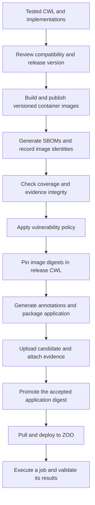

# Secure, promote and deploy

The earlier modules gave us a tested workflow, container images, generated metadata and a reviewed version change. This final module connects them into a release that another environment can retrieve and run.

Three activities are involved:

- **Secure the release process:** collect evidence about the software dependencies, check its integrity and apply a defined vulnerability policy.
- **Promote a release:** identify a specific candidate as the accepted release after the required checks and review.
- **Deploy and execute:** install the selected application in a processing service, supply inputs and verify the results of a job.

The CWL contract connects these activities. It identifies the processing tools and container dependencies to inspect, becomes the application artifact we distribute, and tells the execution backend how the workflow runs. The contract enables these checks; it does not perform them by itself.

## Understand the objects being released

We distribute both the processing environments and the workflow that uses them:

| Object | What it contains or describes |
| --- | --- |
| **Four container images** | The executable environments for crop, normalized difference, Otsu and STAC packaging. |
| **Release CWL** | The workflow and tool contracts, with the release version and selected container identities. |
| **Application artifact** | The CWL packaged for storage and retrieval through an OCI registry, with generated annotations. It references the images through CWL rather than embedding all four images. |
| **Evidence** | Inventories, image identities, coverage information and compatibility findings associated with the release. |

**OCI** means Open Container Initiative. Its distribution formats support artifacts beyond executable images. **ORAS** is the command-line tool used here to package, transfer and associate those artifacts. An OCI **manifest** describes an artifact's content and metadata; an **OCI layout** stores it locally on disk. See the [ORAS artifact guide](https://oras.land/docs/concepts/artifact/).

A **tag**, such as `1.0.0`, is a readable release name. A **digest**, such as a full `sha256` hash, identifies particular content. Registries may allow tags to move, so release checks and deployment should track the accepted digests.

## Follow the release sequence



Each stage supplies information needed by the next. For example, the release cannot pin inspected registry digests until the images are available for inspection. Publishing those container dependencies is an intermediate step: it does not mean the final application has passed promotion.

## Prepare the tools and choose an exercise scope

Use the repository setup and tests from earlier modules. Container work requires Docker. Packaging uses the **ORAS CLI**, and image inventory and vulnerability assessment use **Trivy**. The reference workflow selects ORAS 1.3.1 and Trivy 0.75.0; see [Prerequisites](../../prerequisites.md) for the setup context.

There are three useful scopes:

| Scope | What you need | What you can establish |
| --- | --- | --- |
| **Local packaging** | Installed application tooling and ORAS. | The CWL and annotations can be packaged, inspected and retrieved from a local layout. |
| **Image inventory and policy** | Built images, Docker, Trivy and an accessible registry; database access for vulnerability scanning. | The declared images can be inventoried and assessed against the selected policy. |
| **Publication and remote execution** | Registry publication permissions, release review, a configured ZOO service and backend-accessible input storage. | A promoted application can be deployed and executed in that environment. |

Completing the first scope does not establish the results of the others. Work from the repository root in the examples below. The full command sequences are also maintained in [Supply-chain assurance](../../supply-chain.md) and [Deployment](../../deployment.md).

## 1. Prepare the candidate and its images

Begin with the checked application and a reviewed release version:

```console
task reference:test
task release:prepare VERSION=1.0.0
task containers:build VERSION=1.0.0
```

Release preparation writes `build/release/waterbodies.cwl`. It sets the application version and versioned container references without editing the canonical source contract in place. Building creates the corresponding local images.

Before a real release, apply the compatibility assessment from [Baselining](../11-assure-the-contract/lesson.md) against the previous promoted contract. Keep the Python package version, release CWL and packaging metadata coherent; setting an image tag alone does not change the package version.

The inventory plugin used here inspects images through a registry. A successful local Docker build is therefore insufficient for remote inventory. The protected release workflow publishes the versioned images before scanning them. For practice without a public push, use the repository's local integration exercise described below.

## 2. Generate a software inventory

An **SBOM**, or software bill of materials, is an inventory of software components. **CycloneDX** is the format used for these inventories. An inventory helps answer “what software was observed?”; a vulnerability assessment asks a separate question about known weaknesses in that software.

The **cwl2sbom Transpiler-Mate plugin** follows the selected workflow's reachable tools and inspects their declared containers with Trivy. It records which images and platform were examined. Here, `linux/amd64` identifies Linux on the AMD64/x86-64 architecture; do not assume inspection of one platform establishes results for another.

When the release images are available in an accessible registry, generate a new bundle:

```console
task sbom:generate CONTRACT=build/release/waterbodies.cwl PLATFORM=linux/amd64 SBOM=build/sbom
```

The output directory must not already exist. For another run, choose a new `SBOM` path and use that same path in subsequent checks. Keep earlier bundles when they are evidence for earlier candidates.

The bundle contains several complementary files:

| File | Purpose |
| --- | --- |
| `workflow.cdx.json` | Records the workflow, tools and their image relationships. |
| `images/*.cdx.json` | Records software inventoried inside each inspected image. |
| `images.lock.json` | Connects image references to repository digests, platform, inventory files and checksums. |
| `coverage.json` | Reports which reachable tools were covered and the inspection limitations. |

**Complete declared-tool coverage** means the workflow's declared container dependencies were covered. It does not mean every possible runtime dependency was discovered. Software downloaded during execution or supplied by the host is outside this inventory's scope. The workflow SBOM therefore intentionally reports incomplete aggregate composition even when all four declared tools are covered.

### Practice with a temporary local registry

After building the 1.0.0 images, run:

```console
task supply-chain:integration
```

This starts a temporary registry bound to localhost, uploads the four locally built images there, writes a temporary contract with those registry references, generates `build/sbom-local` and checks the bundle. The registry is removed afterward. This exercise does not publish to GHCR or run the vulnerability-policy script.

The checked-in bundle under `reference/expected/sbom/local-example` is historical teaching evidence. Its temporary registry addresses are not a promoted release or a current source of images. Generate fresh evidence for the candidate being assessed.

## 3. Check coverage, identity and file integrity

Before interpreting inventory content, check that it belongs to the intended contract and has not changed relative to its recorded checksums:

```console
task sbom:check CONTRACT=build/release/waterbodies.cwl SBOM=build/sbom
```

The checker verifies coverage of the four declared containers, correspondence between contract references and inspected identities, consistent platform information, and the checksums of image SBOM files.

A **checksum** is a hash computed from file bytes. Recomputing it detects a mismatch with the recorded value. This is an integrity check, not proof that the person supplying both the file and checksum is trusted.

Do not confuse this with `task supply-chain:check`. That task checks the contract's image-reference conventions and runs supply-chain tests. It does not itself generate or validate a fresh release SBOM bundle and does not scan the release for vulnerabilities.

## 4. Apply the vulnerability policy

Trivy can assess an SBOM against its vulnerability information. The repository applies a specific educational policy through:

```console
bash supply-chain/policy/scan.sh build/sbom
```

For the local integration bundle, pass `build/sbom-local` instead. The script scans the image SBOMs and exits with failure if it finds a vulnerability rated **HIGH** or **CRITICAL**, including findings without a published fix. A nonzero exit status is how the pipeline knows it must stop. Trivy's [SBOM scanning documentation](https://trivy.dev/docs/latest/target/sbom/) describes the underlying operation.

The policy does not claim to assess licenses or reject every lower-severity finding. Database availability and freshness matter: a previously passing image may receive new findings later. A passing result means this assessment found no policy-blocking vulnerabilities, not that the software is proven secure.

When the gate fails, investigate the affected dependencies or base image, rebuild as appropriate and generate new evidence. If an organization permits exceptions, they need a separately reviewed policy decision with rationale and expiry; this script provides no automatic exception mechanism.

## 5. Pin the inspected images and package the application

After the registry inspection and policy checks, write the recorded image digests into the release CWL:

```console
uv run python scripts/supply_chain.py prepare --version 1.0.0 --lock build/sbom/images.lock.json
uv run cwltool --validate 'build/release/waterbodies.cwl#waterbodies'
task sbom:check CONTRACT=build/release/waterbodies.cwl SBOM=build/sbom
```

This sequence expects evidence for the canonical release image references, not the temporary localhost exercise. The second bundle check ensures the digest references in the rewritten contract match the inspected images. The release now points to specific environments rather than whichever content the version tags may later name.

Generate annotations and package that release contract locally:

```console
task oci:package VERSION=1.0.0 CONTRACT=build/release/waterbodies.cwl
task oci:inspect VERSION=1.0.0
oras pull --oci-layout build/oci:1.0.0 -o build/restored
```

The **cwl2oci plugin** generates descriptive annotations under a `$manifest` wrapper. ORAS applies them while packaging `waterbodies.cwl` with the `application/cwl` artifact type. The local layout is stored under `build/oci`; the pull command retrieves its CWL into `build/restored`.

The packaging script checks that the requested package version, CWL version and annotation version agree. It uses a fixed teaching-example creation timestamp to avoid changing the manifest digest merely because packaging was rerun. Review that timestamp policy when preparing an actual release.

For a packaging-only exercise, `task oci:package` without the release-contract override packages the canonical contract. That demonstrates the mechanics, but does not establish that the referenced containers passed fresh release gates. Despite ORAS's use of the word `push` internally, `--oci-layout` writes locally; these commands perform no registry publication.

## 6. Associate evidence and promote the candidate

**Promotion** designates an accepted artifact for release. It should refer to the artifact already checked, rather than rebuild different content after the checks.

In this repository, `supply-chain/oras/publish.sh` performs these operations after the preceding release gates:

1. Upload the local application layout under a candidate tag, such as `1.0.0-candidate`, and resolve its digest.
2. Attach the workflow CycloneDX inventory to that application digest.
3. Attach each image's CycloneDX inventory to its corresponding container digest.
4. Attach the lock, coverage and baseline reports to the application digest.
5. Apply the final version tag to the same application digest and check that it resolves correctly.

An attached artifact is also called a **referrer**: it refers to another artifact as its subject. These associations let a consumer find evidence for a particular release. Check discovery and retrieve the evidence; the existence of an attachment alone is not evidence that its contents passed your policy.

The release workflow in `.github/workflows/release.yaml` is manually started with the version, previous promoted contract and reviewed compatibility classification. Its verification job runs first. Only the publication job receives `packages:write` permission and uses the GitHub environment named `release`.

Configure required reviewers on that environment to enforce the intended approval boundary. Merely naming an environment in YAML does not configure required reviewers. GitHub documents these controls in [Managing environments](https://docs.github.com/en/actions/how-tos/deploy/configure-and-manage-deployments/manage-environments).

The manual `task release:publish` also requires an explicit approval flag and existing prepared artifacts. It does not build the image dependencies or perform the entire release workflow for you. Prefer the documented protected pipeline for an actual release; generating an SBOM does not authorize publication.

### Where signatures and provenance fit

A **signature** can bind an artifact to a signing identity that a consumer verifies under a chosen trust policy. **Build provenance** records information about how an artifact was produced, such as its build inputs and process. These answer different questions from inventory or vulnerability scanning.

Signing and provenance are optional extensions in this course, not outputs that the current scripts fabricate. A team adding them must define which identities and assertions it accepts and verify the exact artifact subjects. An attached signature without that verification does not establish release trust.

## 7. Retrieve and deploy the promoted application

**Deployment** installs the application into a service so it can accept execution requests. **Execution** starts a particular job with input values. They are separate operations.

Here, ZOO supplies an OGC API – Processes service and an execution backend. The server, backend, registry access, authentication and staging storage must be configured first. Follow [the deployment guide](../../deployment.md) for the environment-specific details.

Retrieve the accepted application by its real digest:

```bash
export EOAP_REF='ghcr.io/eoap/waterbodies@sha256:REPLACE_WITH_PROMOTED_DIGEST'
oras discover "$EOAP_REF"
oras pull "$EOAP_REF" -o build/promoted
```

Replace the placeholder with the complete inspected digest. Verify the associated evidence and selected content before installation. The documented integration does not assume ZOO accepts an OCI reference directly; it submits the pulled CWL bytes:

```bash
export API='http://localhost:8080/ogc-api'
curl --fail-with-body -X POST "$API/processes?w=waterbodies" \
  -H 'Accept: application/json' \
  -H 'Content-Type: application/cwl+yaml' \
  --data-binary @build/promoted/waterbodies.cwl
```

`API` is the service base URL; replace it for your installation. `--data-binary` sends the file contents, while the content-type header tells the server they are CWL YAML. The `w` selector follows this ZOO deployment route. Supply authentication through the configured client or environment rather than committing credentials.

Discover the installed process and inspect its description and package:

```bash
curl --fail-with-body "$API/processes"
curl --fail-with-body "$API/processes/waterbodies"
curl --fail-with-body "$API/processes/waterbodies/package"
```

Use the identifier and links actually returned if the server assigns a different process ID. Compare the installed tool definitions and image digests with the promoted CWL. The cwl2ogc description from an earlier lesson helps describe an interface; generating it did not install this service.

## 8. Stage inputs, start a job and validate the result

A remote server cannot automatically read a path on your laptop. The workflow's `item` input requires a staged STAC **Directory** containing `catalog.json`, linked Item metadata and the band assets. A URL pointing only to an Item JSON is not the same input.

Transfer or prepare the complete source directory using your backend's staging mechanism, preserve its relative links and confirm backend access. Inspect the deployed input schema and staging conventions. There is no universal upload endpoint assumed here.

`supply-chain/examples/execute.json` illustrates a request, but its Directory location is a placeholder. Prepare `build/execute.json` with a representation supported by your backend and an accessible location. Keep the exercise's AOI and band values if you transferred the synthetic fixture.

Submit the request:

```bash
curl --fail-with-body -D build/job.headers \
  -X POST "$API/processes/waterbodies/execution" \
  -H 'Content-Type: application/json' \
  -H 'Prefer: respond-async' \
  --data-binary @build/execute.json
```

An **asynchronous** request lets the service return a job reference while processing continues. `-D` saves response headers, which may contain the status location. Acceptance of a request is not successful completion: capture the returned job identifier and follow its status link.

For the documented ZOO routes:

```bash
export JOB_ID='REPLACE_WITH_RETURNED_JOB_ID'
curl --fail-with-body "$API/jobs/$JOB_ID"
curl --fail-with-body "$API/jobs/$JOB_ID/results"
```

Wait for a successful terminal status before retrieving results. If the job fails, inspect backend diagnostics, input access and container availability. Retrieve the returned result catalog and assets, parse them through PySTAC and validate the Item and declared extensions. For the synthetic fixture, confirm the 6×6 mask and 18 water pixels as in [Run the application](../09-run-the-application/lesson.md).

## Record what succeeded and diagnose what did not

Keep the promoted application digest, deployed process identifier, returned package identity, successful job identifier and validated result together. That connects the release decision to an observable execution. This repository does not contain a fabricated live deployment result; a real result requires the configured external environment.

| Observation | What to investigate |
| --- | --- |
| Inventory cannot find an image | Whether it was uploaded to the intended registry, credentials and platform selection. |
| Coverage or checksum check fails | Whether the bundle matches this contract and whether its files changed. |
| Vulnerability policy fails | The reported packages, base image and available fixes; regenerate evidence after changes. |
| Metadata versions disagree | The candidate CWL, generated annotations and intended package version. |
| Deployment succeeds but execution fails | Backend staging, image access, runtime configuration and job diagnostics. |
| A job succeeds but results differ | The submitted inputs, deployed contract, actual image identities and scientific outputs. |

Each gate establishes a limited fact. Inventory, integrity, vulnerability policy, review, publication and execution are all needed to understand the complete result.

## Contract questions

**What are we designing?** A release path from tested CWL and container dependencies to an accepted immutable application artifact and a verified remote execution.

**Why does it belong in the contract?** The declared workflow and container references connect the application interface to the software inspected, packaged and deployed.

**What can be derived?** Inventories, inspected image identities, coverage evidence, OCI annotations and a release CWL pinned to the inspected containers. Policy decisions, approval and live execution require additional steps.

**How do we verify it?** Complete [the exercise](exercise.md) at the available scope: inspect local packaging, check fresh inventory and policy evidence, then deploy a promoted digest to a configured service and validate its actual results.

[Module overview](README.md)
