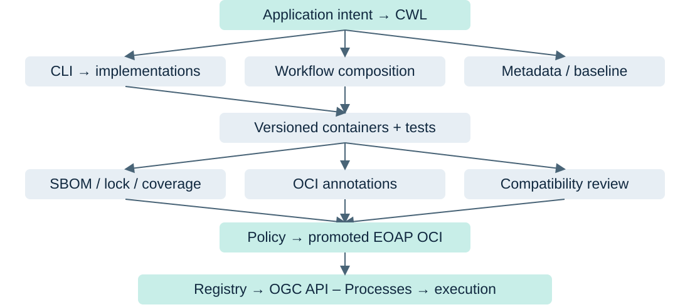

<!-- _class: title -->

# Water Bodies

## Contract-First EO Application Development

From CWL design to a supply-chain-aware EOAP
deployed with OGC API – Processes

<!--
Course thesis: CWL is the application contract, not an after-the-fact wrapper around a Python script. Lead developers from intent to traceable execution. The local workflow is reproducible; remote deployment requires prepared infrastructure. Customize instructor name, event and API environment in the delivery copy.
-->

---

# What learners will build

```text
waterbodies
├── crop
├── norm-diff
├── otsu
└── stac
```

CWL Workflow · versioned containers · SBOM evidence

EOAP OCI artifact · OGC API – Processes deployment

<!--
Teaching goal: show the public interface immediately. The CLI is generated from the four CWL CommandLineTool declarations. The application artifact and the four container images are separate artifacts.
-->

---

<!-- _class: diagram -->

# The destination

```text
CWL contract → implementation → workflow
                                  ↓
                              containers
                                  ↓
assurance → OCI artifact → OGC API – Processes
```

<!--
Ask learners to identify the stage they currently know best. Return to this map at the supply-chain transition.
-->

---

# Instructor pacing

| Teaching block | Minutes |
| --- | ---: |
| Intent, science and tool contracts | 45 |
| CLI, implementation and composition | 55 |
| Break | 10 |
| Containers, projections and evolution | 40 |
| Supply chain and OCI | 40 |
| Deployment, recap and discussion | 25 |

<!--
Total: 215 minutes including the break. For two 90-minute sessions, use 40/50 minutes for sections 1–6, then 30/35/25 minutes for sections 7–13; prebuild containers and inventory, demonstrate stored evidence, and reserve remote execution setup as prework. Check every live demo before class. The full lesson exercises extend beyond the lecture.
-->

---

<!-- _class: divider -->

# 01 · Why contract-first?

Define the promise before writing the algorithm.

<!--
15 minutes within the opening block. Ask: what must another developer know to invoke this application without reading Python?
-->

---

# Reverse the usual starting point

| Implementation-first | Contract-first |
| --- | --- |
| Python script | Application intent |
| CLI | CWL contract |
| Container | Derived interfaces |
| CWL wrapper | Implementation → container |

<!--
Emphasize: we are deliberately reversing the usual wrap-an-existing-script teaching pattern. Existing science may be reused, but the public processing interface is designed explicitly.
-->

---

<!-- _class: diagram -->

# Design down; verify up

**Top-down contract design with bottom-up implementation and verification.**

```text
Intent → workflow contract → tool contracts
                                 ↓
                           implementation
                                 ↓
Tool tests → workflow tests → release → deployment
```

<!--
The design path determines requirements. The verification path supplies evidence that implementation fulfills them. Neither a valid YAML file nor passing algorithm tests alone proves the whole application.
-->

---

<!-- _class: divider -->

# 02 · Understand Water Bodies

A small scientific chain with real software boundaries.

<!--
10 minutes. Keep EO theory brief: this classifier is a teaching application, not a globally calibrated or cloud-screened water product.
-->

---

<!-- _class: diagram -->

# Inputs and scientific chain

```text
STAC Directory + AOI + EPSG
             ↓
green / NIR → crop → NDWI → Otsu → water mask
                                         ↓
                                   STAC Catalog
```

NDWI = (green − nir) / (green + nir)

<!--
The input is a self-contained catalog Directory, with catalog.json, a linked Item and relative band assets. It is not just an Item JSON URL. EPSG describes the AOI CRS; crop transforms the AOI into the raster CRS rather than reprojecting the pixels.
-->

---

<!-- _class: diagram -->

# One source; two branches

```text
bands = [green, nir]

                 ┌→ crop(green) ─┐
STAC + AOI + CRS ─┤               ├→ norm-diff
                 └→ crop(nir) ───┘      ↓
                                     otsu → stac
Original STAC ──────────────────────────────┘
```

<!--
Teaching goal: distinguish dataflow from execution sequence. STAC receives both the original source and the new mask. Array order is meaningful: green then nir.
-->

---

<!-- _class: divider -->

# 03 · Design the CWL tool contracts

Inputs, bindings and outputs describe a public API.

<!--
20 minutes. Start with Directory versus File and the class of each process. The packed $graph contains one Workflow plus four tools.
-->

---

<!-- _class: demo -->

# DEMO 1 · Inspect the contract

```console
task contract:validate
uv run cwltool --print-pre reference/waterbodies.cwl#crop
```

<!--
Exact commands, from the repository root:
task contract:validate
uv run cwltool --print-pre reference/waterbodies.cwl#crop

Open reference/waterbodies.cwl beside the validated output. Identify $graph, #waterbodies, #crop, baseCommand, inputBinding, outputBinding and Docker hints. Validation checks structural validity, not scientific correctness.
-->

---

# crop · the public boundary

```yaml
id: crop
baseCommand: [waterbodies, crop]
```

`item: Directory` · `aoi: string` · `epsg: string` · `band: string`

Output: `cropped: File`

```console
waterbodies crop --input-item data/fixtures/source \
  --aoi 1,1,7,7 --epsg EPSG:4326 --band green
```

<!--
Bindings map item to --input-item and the other inputs to their named options. OutputBinding collects crop_*.tif from the tool working directory. Run standalone examples in a scratch working directory if output files already exist.
-->

---

# norm-diff · an ordered array

`rasters: File[]` → `ndwi: File`

```console
waterbodies norm-diff \
  --rasters crop_green.tif --rasters crop_nir.tif
```

**Exactly two matching grids, in green / NIR order.**

<!--
Show the actual array binding: the outer inputBinding is empty; --rasters belongs to each array item. Repeating the outer prefix would create a stray option. The implementation checks grid agreement and zero denominators.
-->

---

# otsu · classify the index

`raster: File` → `binary-mask: File`

```console
waterbodies otsu --raster norm_diff.tif
```

Output: `otsu.tif`, with 0 for non-water and 1 for water.

<!--
Otsu receives the index, not the original reflectance bands. The threshold is derived from finite NDWI pixels; classification uses strictly greater than the threshold. Nonfinite pixels are non-water. The command assumes norm-diff has already run in this directory.
-->

---

# stac · publish the scientific result

Original source `Directory` + water mask `File`

↓

Validated STAC catalog `Directory`

```console
waterbodies stac --input-item data/fixtures/source \
  --water-body otsu.tif
```

<!--
STAC writes catalog/ using PySTAC and its extension APIs. Preserve source Item identity/time, derive the output footprint from the mask and validate the declared extensions. This is output packaging, not registry publication. The example assumes otsu.tif exists from the prior command.
-->

---

<!-- _class: interaction -->

# INTERACTION · Which is the source of truth?

**CWL declarations or generated Click options?**

An input changes. Which file should we edit first?

<!--
Expected response: change CWL first, regenerate the CLI and downstream views, then update implementation and tests. Never independently maintain a second public option list.
-->

---

<!-- _class: divider -->

# 04 · Derive the CLI

The command hierarchy is a projection of the contract.

<!--
10 minutes. Explain generation before showing generated Python.
-->

---

<!-- _class: demo -->

# DEMO 2 · Generate the interface

```console
task cli:generate
task cli:test
```

<!--
Exact commands, from the repository root:
task cli:generate
task cli:test

Inspect reference/src/waterbodies/waterbodies.py without editing it. cwl2click --bundle uses [waterbodies, crop] and [waterbodies, norm-diff] to produce a shared group; the tool IDs map to *_impl.execute imports. Tests compare parsed Python syntax because timestamps and traversal order can vary.
-->

---

<!-- _class: demo -->

# DEMO 3 · Read the public commands

```console
uv run waterbodies --help
uv run waterbodies crop --help
uv run waterbodies norm-diff --help
uv run waterbodies otsu --help
uv run waterbodies stac --help
```

<!--
Exact commands, from the repository root:
uv run waterbodies --help
uv run waterbodies crop --help
uv run waterbodies norm-diff --help
uv run waterbodies otsu --help
uv run waterbodies stac --help

Pause: the help hierarchy comes from the contract. The help order may vary, but all four subcommands exist. Ask learners to locate Directory validation and repeated --rasters options.
-->

---

<!-- _class: diagram -->

# Contract → CLI → callback

```text
CWL $graph / baseCommand / inputBinding
                 ↓ cwl2click --bundle
waterbodies {crop, norm-diff, otsu, stac}
                 ↓ generated options
{crop,norm_diff,otsu,stac}_impl.execute
```

<!--
Teaching goal: the CLI is a projection of the contract. cli.py re-exports the generated group for the installed console entrypoint. The generated bundle owns argument plumbing, not the scientific algorithm.
-->

---

<!-- _class: divider -->

# 05 · Implement the processing steps

The contract owns interface; implementation owns behavior.

<!--
15 minutes. Keep examples short and inspect the relevant implementation only when a question needs it.
-->

---

# A typed callback fulfills the promise

```python
def execute(
    *, input_item: Path, aoi: str, epsg: str, band: str
) -> None:
    ...
```

CWL input → Click option → callback parameter → behavior

**Write the declared output in the working directory.**

<!--
Snippet follows crop_impl.execute; Path is imported under TYPE_CHECKING there. input_item is the Python-normalized --input-item name. The callback writes crop_<band>.tif, rather than returning the CWL output value directly. The runner collects the declared glob.
-->

---

# Science and metadata need verification

| Step | Behavior to verify |
| --- | --- |
| crop | EO band selection; AOI transformed into raster CRS |
| norm-diff | Matching grids; finite arithmetic; ordered bands |
| otsu | Strictly above threshold; nonfinite → non-water |
| stac | PySTAC objects and extensions; validated output |

<!--
STAC uses the Terradue PySTAC fork with validation support. Projection and Raster extension APIs supply metadata. Source identity/time are preserved; the output footprint is derived from the mask grid. Do not manipulate serialized STAC dictionaries as a substitute for PySTAC APIs.
-->

---

<!-- _class: divider -->

# 06 · Compose the workflow

Wire the same tool contracts into typed dataflow.

<!--
30 minutes. Predict the scatter shape before showing the full runner output.
-->

---

# Workflow vocabulary

```yaml
class: Workflow
steps:
  norm-diff:
    run: "#norm-diff"
    in: {rasters: crop/cropped}
    out: [ndwi]
```

`run`: tool reference · `in`: source wiring · `out`: exposed port

<!--
A step input source here uses CWL map shorthand. Explain source explicitly: rasters: crop/cropped is the shorthand equivalent of rasters: {source: crop/cropped}. Workflow outputs use outputSource, which is a separate wiring field.
-->

---

# Scatter fans out; arrays fan in

```yaml
crop:
  run: "#crop"
  in: {item: item, aoi: aoi, epsg: epsg, band: bands}
  scatter: band
  scatterMethod: dotproduct
  out: [cropped]
```

`bands: [green, nir]` → two crop runs → `File[]`

<!--
ScatterFeatureRequirement is declared at Workflow level. Only band is scattered; common inputs are reused. dotproduct with one scattered input preserves the green/nir array order. Fan-in supplies that array to one norm-diff call.
-->

---

<!-- _class: interaction -->

# INTERACTION · Predict the fan-in

crop runs twice.

**How many times does norm-diff run?**

What type and order does it receive?

<!--
Expected response: once, receiving File[] in green/nir order. norm-diff is not scattered. Ask what reverses if learners swap the bands: the NDWI sign changes; this is a semantic issue beyond CWL array typing.
-->

---

<!-- _class: diagram -->

# Collect the final application output

```yaml
outputs:
  stac-catalog:
    type: Directory
    outputSource: stac/stac-catalog
```

```text
crop[green,nir] → norm-diff → otsu → stac
                                        ↓
                                catalog Directory
```

<!--
Return to the fan-out/fan-in diagram. The source Item also reaches stac. A Workflow output is the public port; outputSource describes the internal wiring.
-->

---

<!-- _class: divider -->

# 07 · Containerize and execute

Containers supply execution environments for contract-defined components.

<!--
25 minutes. Take the break before this section in the full session. Prebuild the images for a reliable live demo.
-->

---

# Four versioned environments

```text
ghcr.io/eoap/waterbodies-crop:1.0.0
ghcr.io/eoap/waterbodies-norm-diff:1.0.0
ghcr.io/eoap/waterbodies-otsu:1.0.0
ghcr.io/eoap/waterbodies-stac:1.0.0
```

Rocky Linux builder → wheels → non-root runtime

**A shared application package; four component references.**

<!--
These are actual canonical Docker hints, but public availability is not assumed. task containers:build creates local tags. All four currently share the application wheel and dependency set; separate names do not imply minimal per-tool dependencies. Company Dockerfiles guide multi-stage builds, UID 2000 and pip removal.
-->

---

# Tag versus digest

| Reference | Meaning |
| --- | --- |
| `:latest` | Mutable naming convention |
| `:1.0.0` | Human-friendly version reference; still mutable |
| `@sha256:…` | Immutable content identity |

Release CWL pins **inspected digests**, with platform evidence.

<!--
Do not say tags are immutable. A digest names content, not publisher trust or security. Ellipses are conceptual placeholders and cannot be executed. The lock records linux/amd64 inspection and repository digest identity.
-->

---

<!-- _class: interaction -->

# INTERACTION · Can we reproduce :latest?

The same CWL runs a week later.

**What if the tag points at different bytes?**

Which identity belongs in a promoted release?

<!--
Expected response: tags can move, including version tags. Pin inspected digests and keep platform/inventory evidence. Discuss reproducibility separately from image authenticity.
-->

---

<!-- _class: demo -->

# DEMO 4 · Run the complete workflow

```console
task workflow:run
task containers:build
task workflow:run-container
```

<!--
Exact commands, from the repository root:
task workflow:run
task containers:build
task workflow:run-container

Run the local workflow first; use prebuilt images if classroom time is limited. Outputs: build/result/catalog and build/container-result/catalog. The compact fixture yields a 6×6 mask with 18 water pixels. These tasks do not push images. Run task workflow:test if learners want the automated public behavior checks.
-->

---

# Three execution levels

| Level | What it isolates |
| --- | --- |
| Python callback | Algorithm and edge cases |
| Generated CLI | Options, paths and callback wiring |
| CWL Workflow | Staging, scatter, outputs and environments |

Fixture → workflow → mask → validated STAC

<!--
The local cwltool task uses --no-container, while the container task exercises the four images. Tool tests alone cannot prove CWL array bindings, directory relocation or output globs.
-->

---

<!-- _class: divider -->

# 08 · Derive application artifacts

One contract, many downstream views.

<!--
10 minutes. Generated files are reviewable projections, not new authoritative interfaces.
-->

---

<!-- _class: diagram -->

# One contract, many projections

```text
waterbodies.cwl
  ├── cwl2click    → CLI
  ├── cwl2markdown → docs
  ├── cwl2puml     → diagram
  ├── cwl2inputs   → input templates
  └── cwl2ogc      → process description
```

<!--
All these tools are pinned and used by this repository. The lower tools also derive directly from CWL, not from markdown output. The repository adapter fixes the pinned cwl2markdown template filename mismatch. PlantUML source generation is verified; no native Mermaid renderer is assumed.
-->

---

<!-- _class: demo -->

# DEMO 5 · Generate downstream views

```console
task artifacts:derive
```

<!--
Exact commands, from the repository root:
task artifacts:derive

Inspect reference/expected/{docs,diagrams,ogc,oci,publication} and reference/expected/inputs.yaml. The docs output currently has a .md.jinja suffix. cwl2puml emits PlantUML without an image rendering service. cwl2inputs locations require real data; cwl2ogc does not install a process. Explain that regeneration can change timestamps or ordering.
-->

---

<!-- _class: divider -->

# 09 · Evolve and assure the contract

CWL is a versioned public processing API.

<!--
5 minutes. Baseline findings inform review; they cannot prove every compatibility or scientific behavior claim.
-->

---

<!-- _class: diagram -->

# A real breaking change

```text
v1: epsg defaults to EPSG:4326
                ↓ remove default
v2: callers must supply epsg
                ↓
cwl-baseline-plugin + behavioral review → major
```

```console
task baseline:check
```

<!--
This is the actual modules/11 example, reviewed as major 1.0.0→2.0.0. A new optional input may be additive, but its defaults/behavior still require review. The plugin can also report anonymous array-name changes; inspect findings. The task’s major review is lesson-specific, not an automatic production approval.
-->

---

<!-- _class: interaction -->

# INTERACTION · Choose a version; explain why

**A parameter becomes required.**

What breaks for existing callers?

What evidence does a baseline report miss?

<!--
Expected response: existing requests omitting the parameter fail; major change. A report alone cannot establish scientific equivalence or every backend compatibility. Require behavioral tests and explicit release review.
-->

---

<!-- _class: divider -->

# 10 · Secure the software supply chain

The CWL knows which declared software components make up the application.

<!--
25 minutes. This is a core section. CWL enables supply-chain assurance; it does not secure the supply chain by itself.
-->

---

<!-- _class: diagram -->

# Turn dependencies into evidence

```text
CWL → crop / norm-diff / otsu / stac → images
                                         ↓
Inventory → SBOM → analysis → policy → promotion
```

**Machine-readable contracts enable traceability.**

<!--
The graph represents declared dependencies, not proof of every byte that ran. Runtime downloads, host tools and engine dependencies can lie outside inventory scope. A complete declared-tool coverage report is not a complete global software inventory.
-->

---

<!-- _class: demo -->

# DEMO 6 · Generate real SBOM evidence

```console
task supply-chain:integration
```

<!--
Exact commands, from the repository root:
task supply-chain:integration

First run task containers:build. This task uses those real local images and a disposable localhost registry, then invokes cwl2sbom and validates evidence. Requires Docker, Trivy, ORAS, registry access and available disk. Read scripts/local_supply_chain.sh first; it cleans up its registry. Generation is slow: use the historical bundle as a clearly labeled inspection fallback. For production registry images use task sbom:generate CONTRACT=build/release/waterbodies.cwl SBOM=build/sbom-fresh PLATFORM=linux/amd64 after image publication; a local Docker tag alone is insufficient. cwl2sbom does not push, attach or sign.
-->

---

# Read the bundle, not just a package list

| Output | Evidence |
| --- | --- |
| `workflow.cdx.json` | Workflow → tools → container relationships |
| `images/*.cdx.json` | Per-image package/library inventories |
| `images.lock.json` | Digests, platform, checksums, associations |
| `coverage.json` | Covered declarations and limitations |

<!--
The bundle is local output. cwl2sbom forces remote Trivy inspection in the pinned implementation. Existing output directories are protected: choose a fresh SBOM directory. Aggregate CycloneDX composition remains incomplete to disclose inventory scope limits.
-->

---

<!-- _class: diagram -->

# Follow the inventory graph

```text
workflow SBOM
   ├── crop image ─────── image SBOM → packages
   ├── norm-diff image ── image SBOM → packages
   ├── otsu image ─────── image SBOM → packages
   └── stac image ─────── image SBOM → packages
```

Lock evidence binds inventories to **actual image identities**.

<!--
Check repository digests, platform, SBOM checksums and the reachable tool mapping. There can be distinct tool invocations that share an image. Keep package/distro metadata rather than merging away information needed by scanners.
-->

---

# SBOM ≠ vulnerability report

**Inventory:** what was detected in an image.

**Vulnerability report:** findings against a database at scan time.

```text
Image SBOM → Trivy sbom → known vulnerability findings
```

<!--
Separate the stable inventory from time-dependent analysis. Updated databases can change findings for identical bytes. Zero reported CVEs does not prove software secure, and coverage gaps can hide components.
-->

---

# SBOM ≠ signature

**SBOM:** what was inventoried.

**Signature:** an assertion associated with an identity.

**Provenance:** how an artifact was built.

<!--
These are distinct assertions with distinct verification. The repository does not implement or fabricate signatures/provenance. A signing exercise needs an explicit trust policy; an attached SBOM alone supplies neither publisher authenticity nor build provenance.
-->

---

<!-- _class: interaction -->

# INTERACTION · Match evidence to a question

Which answers **what**, **who**, **how**, or **known risk**?

SBOM · signature · provenance · vulnerability report

<!--
Expected mapping: what→SBOM; who→verified signature identity; how→provenance; known risk→vulnerability analysis. Authenticity and provenance still depend on trusted identities and verifiable evidence, not file labels.
-->

---

<!-- _class: diagram -->

# Analysis becomes a contextual policy

```text
SBOM → vulnerability / license analysis
                     ↓
                policy evaluation → release gate
```

```console
bash supply-chain/policy/scan.sh build/sbom
```

Course gate: reject HIGH / CRITICAL vulnerability findings.

<!--
The implemented scan is a vulnerability gate only; it does not implement license approval. License analysis is a separate possible policy input. The historical Debian example failed; rebuilt Rocky crop had no findings at its scan time, not a blanket security claim. Regenerate inventories for current immutable images. Never lower severity or hide findings just to promote.
-->

---

<!-- _class: divider -->

# 11 · Package the EOAP as OCI

Package known CWL; associate evidence with immutable subjects.

<!--
15 minutes. Distinguish annotation generation, local artifact assembly and authenticated registry operations.
-->

---

# cwl2oci produces metadata

```text
org.opencontainers.image.version = 1.0.0
org.opencontainers.image.title   = Water Bodies
org.cwl.entrypoint              = waterbodies
org.cwl.type                    = Workflow
```

**cwl2oci generates annotations.**

ORAS builds the artifact layout and handles distribution.

<!--
The actual output wraps annotations in $manifest for ORAS --annotation-file. cwl2oci neither builds nor pushes the OCI artifact. The annotations come from the same selected Workflow and Schema.org software metadata.
-->

---

<!-- _class: demo -->

# DEMO 7 · Inspect a local EOAP artifact

```console
task oci:package VERSION=1.0.0
task oci:inspect VERSION=1.0.0
```

<!--
Exact commands, from the repository root:
task oci:package VERSION=1.0.0
task oci:inspect VERSION=1.0.0

This packages the canonical tagged development CWL in a local OCI layout, not a promoted release. Requires ORAS on PATH. Inspect application/cwl media type, annotation version and the CWL layer. For a release, prepare digest-pinned CWL and use CONTRACT=build/release/waterbodies.cwl after inventory validation. Commands do not publish.
-->

---

<!-- _class: diagram -->

# Application subject; image subjects

```text
waterbodies:1.0.0 → EOAP manifest digest
  ├── CWL layer + manifest annotations
  ├── workflow SBOM referrer (after publish)
  └── lock / coverage / baseline evidence referrer

CWL → four component image digests
        └── each image has its own SBOM referrer
```

<!--
This matches supply-chain/oras/publish.sh: oras cp uploads a candidate from the local layout, oras attach associates workflow/image inventories and application evidence with resolved digest subjects, then oras tag creates the version tag. Attachments are not automatically packed into the initial local artifact. Verify registry referrer support with oras discover. Version remains 1.0.0 to match this repository.
-->

---

<!-- _class: diagram -->

# Build ≠ release ≠ promotion

```text
validate → test → build → inventory → scan
                                      ↓
promote ← package ← policy + compatibility review
```

**Production consumes a promoted application artifact.**

<!--
The protected release workflow requires reviewed baseline classification and release environment authorization. release:publish requires WATERBODIES_PUBLISH=approved and previously built/published images plus validated evidence. Do not run publication as an unannounced classroom demo. The final mutable version tag names an already gated immutable manifest digest.
-->

---

<!-- _class: divider -->

# 12 · Deploy through OGC API – Processes

We have a known application artifact. What do we do with it?

<!--
20 minutes. Verify a running ZOO API and execution backend before teaching. OGC Core execution and ZOO deployment/package operations have different conformance requirements.
-->

---

<!-- _class: diagram -->

# Registry → promoted CWL → ZOO

```text
Resolve promoted EOAP digest
            ↓ oras pull
Known CWL bytes
            ↓ POST /processes?w=waterbodies
Installed process → describe → execute
```

A STAC URL does not substitute for the required Directory.

<!--
ZOO tutorial supports application/cwl+yaml bytes; do not assume it accepts OCI references directly. The w selector is server-specific. Prepare backend-accessible staged catalog and bands. Generated cwl2ogc descriptions do not deploy anything. Source: https://eoap.github.io/ogc-api-processes-with-zoo/deploy-application/
-->

---

<!-- _class: demo -->

# DEMO 8 · Deploy, inspect and execute

```console
task slides:deployment-demo MODE=inspect
```

<!--
Exact commands, from the repository root:
task slides:deployment-demo MODE=inspect

Run MODE=deploy only on the prepared teaching server; MODE=execute submits build/execute.json and saves headers/body; MODE=monitor reads the returned job. Exact commands: task slides:deployment-demo MODE=deploy; task slides:deployment-demo MODE=inspect; task slides:deployment-demo MODE=execute; task slides:deployment-demo MODE=monitor. Set API, EOAP_REF and later JOB_ID as described in slides/README.md. Pull uses the actual promoted digest. Never substitute the placeholder execute.json for verified backend staging. This deck does not claim a live remote job has already succeeded.
-->

---

<!-- _class: diagram -->

# Follow the service lifecycle

```text
Deploy → list → describe → inspect package
                              ↓
Execute → monitor → retrieve result
```

`/processes` · `/processes/{processID}`

`/processes/{processID}/package`

`/jobs/{jobID}` · `/jobs/{jobID}/results`

<!--
These routes are verified against the EOAP ZOO tutorial. Execution POST is /processes/{processID}/execution. Follow returned links and identifiers rather than assuming the requested process ID is unchanged. Backend Directory staging conventions vary. Source: https://eoap.github.io/ogc-api-processes-with-zoo/describe-process/
-->

---

# Close the traceability loop

Promoted artifact digest → installed package identity

Returned process ID → successful job ID

Result href → PySTAC validation → mask verification

**For the compact fixture: 6×6 pixels; 18 water pixels.**

<!--
Record package and immutable image identities, process and job IDs, then retrieve the output catalog and validate its Item/extensions. A submitted job is not a successful execution. The local filesystem path is not reachable storage for a remote backend.
-->

---

<!-- _class: divider -->

# 13 · Recap and discussion

Return from execution to the contract we designed.

<!--
10 minutes. Let learners explain the architecture rather than reading the diagram aloud.
-->

---

<!-- _class: diagram -->

# The complete architecture



<!--
Walk from top-down contract design to bottom-up verification. Ask learners to follow both execution artifacts and evidence. CLI, metadata and baseline projections remain subordinate to the authoritative CWL.
-->

---

<!-- _class: interaction -->

# INTERACTION · Label the architecture

Identify the **contract**, **implementation**, **dependency**,
**evidence**, and **deployment artifact**.

Where would you investigate an incorrect mask?

Where would you investigate a changed image?

<!--
Expected labels: CWL; *_impl.execute; image digest; SBOM/lock/test/baseline; promoted EOAP manifest. Incorrect mask starts with scientific inputs/grid/threshold and tests. Changed image starts with recorded digests and registry evidence. Ask how these investigations meet at the contract.
-->

---

# One source of truth; many verified views

**CWL contract**

CLI · workflow · docs · metadata · inventory · process description

```text
Traceability → inventory → evidence → policy → promotion
```

<!--
Recap: generated projections do not become new sources of truth. Machine-readable contracts enable traceability, while scanners, review and explicit policy establish release decisions. Deployment must preserve that identity chain.
-->

---

# What learners can now do

Design an EO application as a CWL contract.

Derive interfaces; implement, compose and test them.

Package environments; version and assure the contract.

Generate inventory and SBOM evidence; package and promote OCI.

Deploy and execute through OGC API – Processes.

<!--
Final narrative: we began with the application promise, derived interfaces, implemented them, packaged execution environments, tested/evolved the contract, inventoried dependencies and packaged a versioned EOAP. A promoted known artifact is deployed and executed with traceability back to the original contract. Invite questions and direct learners to the 14 module exercises.
-->
